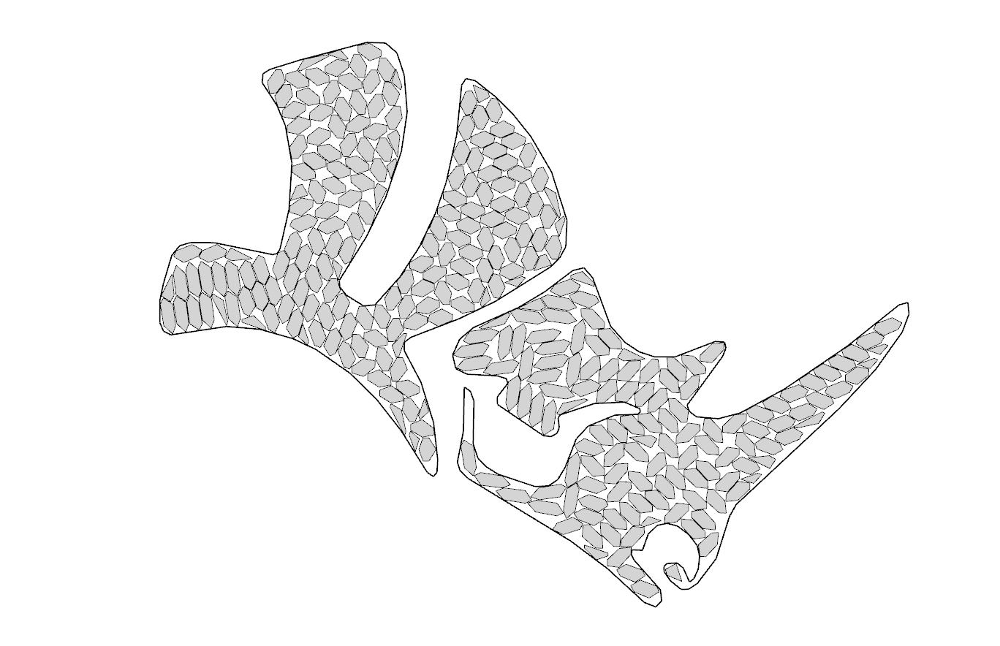

# OpenNest

**2D polygonal nesting for Rhino / Grasshopper** — pack irregular parts onto sheets with minimal waste
(parts and sheets may have **holes**, parts can nest **inside** holes, and sheets can be **non‑rectangular**).
The nesting engines are **C++ implementations**: the algorithms were translated to C++ from their
JavaScript / Rust / C# originals and then **substantially extended**.

## Documentation

Install, components, build & publish: **https://petrasvestartas.github.io/OpenNest/**

## License

OpenNest is released under the **MIT License** — see [LICENSE](LICENSE).

## Credits

Builds on published nesting methods — see **[CREDITS.md](CREDITS.md)**. Original OpenNest, the C++
translation, and all enhancements by **Petras Vestartas**.
