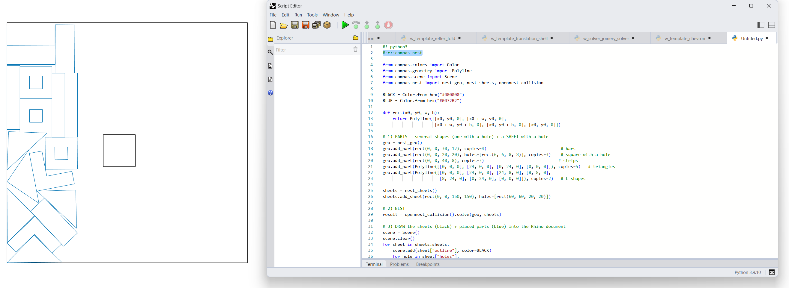

# Python API

**[compas_nest](https://petrasvestartas.github.io/compas_nest/)** is the COMPAS plugin for 2D nesting — the
Python route into the same OpenNest engines. The examples here are written for **Rhino 8 users**: paste any one
straight into the **Script Editor** (Python 3). The `# r: compas_nest` header installs the package on the first
**Run**, and a COMPAS `Scene` draws the result into your Rhino document.

There are **two engines**, same API — `opennest_collision()` (physics / overlap‑relaxation, dense, nests into
holes) and `opennest()` (NFP + genetic algorithm). Every nest is **3 steps**: build the parts + sheets, nest, draw.



The same 8 examples as the [C++](../cpp/index.md) and [C#](../csharp/index.md) pages — here in Python/COMPAS:

| # | Example |
| --- | --- |
| 01 | [Collision](01_collision.md) — physics nest, parts + holes into a sheet + hole |
| 02 | [NFP + GA](02_nfp.md) — NFP + genetic-algorithm engine |
| 03 | [Live animation](03_live.md) — run on a worker thread, poll the evolving layout |
| 04 | [Clearance offset](04_offset.md) — grow parts / shrink sheets before nesting |
| 05 | [Attributes](05_attributes.md) — geometry that travels with the placed part |
| 06 | [Pack (array)](06_pack_array.md) — deterministic grid, columns per row |
| 07 | [Pack (distance)](07_pack_distance.md) — grid, wrap at a max width |
| 08 | [Text (font)](08_text.md) — single-stroke engraving polylines |

## Run it in the Rhino 8 Script Editor

Rhino 8's Python is **CPython 3.9** (`py39-rh8`). Open the **Script Editor** (`_ScriptEditor`), make a new
**Python 3** script, and put the requirements header at the very top — the first **Run** pip‑installs the package
(the editor freezes briefly while it does):

```python
#! python3
# r: compas_nest
```

To show results, draw straight into the Rhino document with a COMPAS **`Scene`** — no `compas_viewer` needed
(that's for a standalone window): `scene.add(geometry, color=…)` then `scene.draw()`.

!!! warning "Two honest caveats inside Rhino"

    1. **Compiled backend.** `compas_nest` is C++ (via nanobind), so it needs Rhino 8's **CPython** runtime — it
       will **not** load under IronPython. It works because PyPI ships a CPython‑3.9 wheel matching Rhino 8, so no
       local compiler is needed; COMPAS flags Rhino 8 CPython support as *experimental*.
    2. **Use `Scene`, not the viewer.** `compas_nest.viewer.animate()` opens a standalone `compas_viewer`
       (PyQt/OpenGL) window — that is **not** the Rhino viewport. Inside Rhino, draw with a COMPAS `Scene` as
       shown in the examples (or bake via `compas_rhino.conversions`).

??? info "Installing into Rhino 8 — three paths"

    | Path | How |
    | --- | --- |
    | In‑editor header (recommended) | Put `# r: compas_nest` (or `# requirements: compas_nest`) under `#! python3` at the top; **Run** once to install. Pin with `# r: compas_nest==0.1.0`; isolate with `# venv: nesting`. |
    | Manual pip (most reliable) | Windows: `%USERPROFILE%\.rhinocode\py39-rh8\python.exe -m pip install compas_nest`  ·  macOS: `~/.rhinocode/py39-rh8/python3.9 -m pip install compas_nest` |
    | COMPAS helper | In a normal Python env with COMPAS installed: `install_in_rhino compas_nest` |

    `compas` (>=2.15,<3) and `numpy` (>=1.24) come in as dependencies.

## The key pieces

| Use this | For | Import |
| --- | --- | --- |
| `nest_geo` | the parts to nest (outlines + holes + copies + attributes) | `from compas_nest import nest_geo` |
| `nest_sheets` | the sheets to pack onto (outlines + keep‑out holes) | `from compas_nest import nest_sheets` |
| `opennest_collision` / `opennest` | run the solve | `from compas_nest import opennest_collision, opennest` |
| `pack` | deterministic grid layout (no nesting) | `from compas_nest import pack` |
| `offset_geo` / `offset_sheets` | clearance before solving | `from compas_nest import offset_geo, offset_sheets` |
| `text_to_polylines` | single-stroke labels | `from compas_nest import text_to_polylines` |
| `nest_result` | read placements (returned by `.solve()`) | — |

Both engines follow the same pattern: construct with tuning params, then `.solve(geo, sheets)` → a `nest_result`.
Read it with `result.placed_polylines()` (grouped per sheet) or `result.transformation(placement)`.

## API reference

??? info "nest_geo, nest_sheets"

    ```python
    class nest_geo(parts=None, name=None)
        add_part(outline, holes=None, copies=1, attributes=None) -> int
        # outline    : closed Polyline (outer ring)
        # holes      : list[Polyline], interior holes (kept empty)
        # copies     : number of identical copies to nest
        # attributes : list[Geometry] carried along with the placement (e.g. Points)

    class nest_sheets(sheets=None, name=None)
        add_sheet(outline, holes=None) -> int          # holes = forbidden interior regions
        @classmethod from_size(width, height, count=1, gap=None) -> nest_sheets
        origins() -> list[tuple[float, float]]          # each sheet's world origin
    ```

??? info "the two engines"

    ```python
    class opennest_collision(iterations=4000, num_rotations=3600, spacing=0.0, seed=100,
        n_starts=1, part_holes_mode=1, pole_max=16, final_compact=2, fit_mode=1,
        max_sheets=0, time_budget_secs=0.0, simplify_tolerance=0.0, verbose=True)
        solve(geo, sheets) -> nest_result      # blocking
        start(geo, sheets) -> collision_solve  # non-blocking background handle

    class opennest(generations=10, rotations=8, placement_type=1, spacing=0.0, seed=30,
        mutation_rate=10, population_size=10, use_holes=True, try_all_rotations=False,
        exact_nfp=False, mode=1, num_seeds=4, use_parallel=True, curve_tolerance=0.3,
        clipper_scale=1e7, sheet_spacing=0.0, rotation_limit=360.0, time_budget_secs=0.0,
        max_sheets=0, verbose=True)
        solve(geo, sheets) -> nest_result      # blocking
        start(geo, sheets) -> nfp_solve        # non-blocking background handle
    ```

    Knob semantics line up with the native structs on the [C++ API](../cpp/index.md) page.

??? info "nest_result, pack, offset, text"

    ```python
    class nest_result(placements, geo, sheet_origins, n_sheets, fitness=None)
        placed / unplaced                                  # properties
        transformation(placement) -> Transformation
        placed_polylines(geo=None) -> list[dict]           # grouped per sheet; each part dict has
                                                           #   "outline", "holes", "attributes"
        to_json(filepath) -> str ; to_obj(filepath) -> str

    pack(geo, columns=10, gap_x=10.0, gap_y=10.0, max_width=None) -> nest_result
    offset_polyline(polyline, distance) -> Polyline | None
    offset_geo(geo, distance) -> nest_geo ; offset_sheets(sheets, distance) -> nest_sheets
    text_to_polylines(text, height=1.0, font="regular", frame=None) -> list[Polyline]
    ```

## Where this fits

OpenNest's nesting engines are native **C++** with a **C#** wrapper for Grasshopper/Rhino — see the
[C++ API](../cpp/index.md) and [C# API](../csharp/index.md). **`compas_nest` is the Python/COMPAS route** over those same engines
(`np_nest` physics + `nfp_nest` NFP/GA), bound via nanobind. For the no‑code Grasshopper path, see
[OpenNest2](../../components/opennest2.md).
