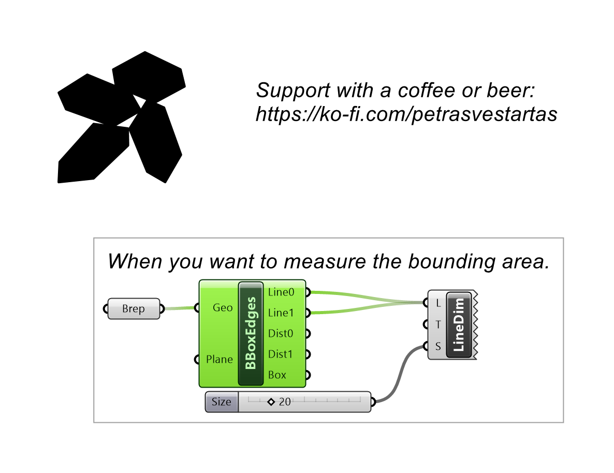
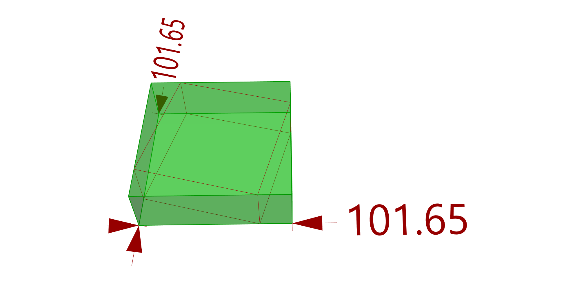

# Bounding Box Edges

Returns the two base edges and their lengths for an object's oriented bounding box.

## Inputs

| Parameter | Type | Access | Description |
| --- | --- | --- | --- |
| **G** (Geo) | Geometry | item | Geometry to bound |
| **P** (Plane) | Plane | item | Orientation plane for the box |

## Outputs

| Parameter | Type | Description |
| --- | --- | --- |
| **L0** (Line0) | Line | First bounding box base edge |
| **L1** (Line1) | Line | Second bounding box base edge |
| **D0** (Dist0) | Number | Length of the first base edge |
| **D1** (Dist1) | Number | Length of the second base edge |
| **B** (Box) | Box | Oriented bounding box |

## Example

**Files to download:**

- [⬇ bounding_box_edges.ghx](files/bbox_edges/bounding_box_edges.ghx)

