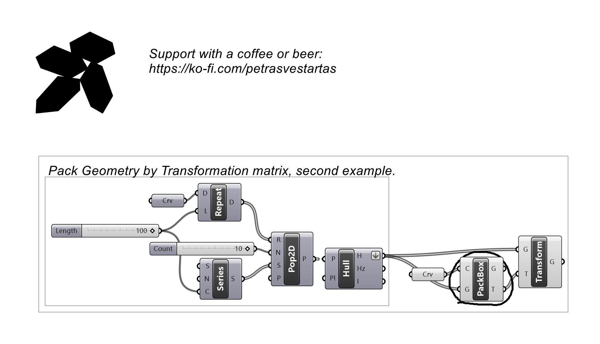
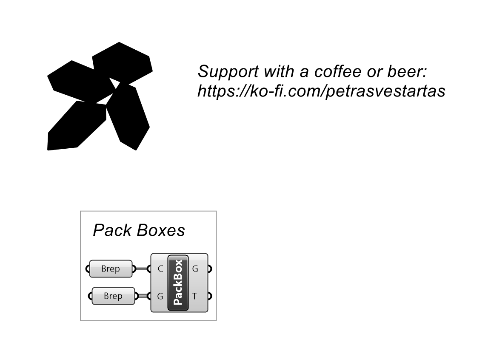
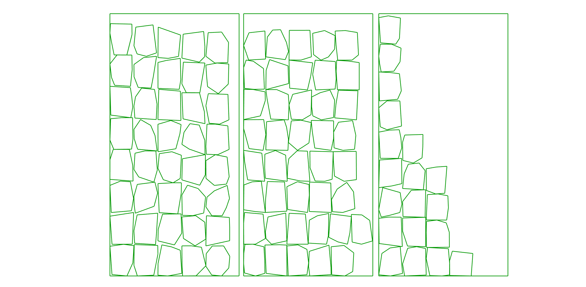
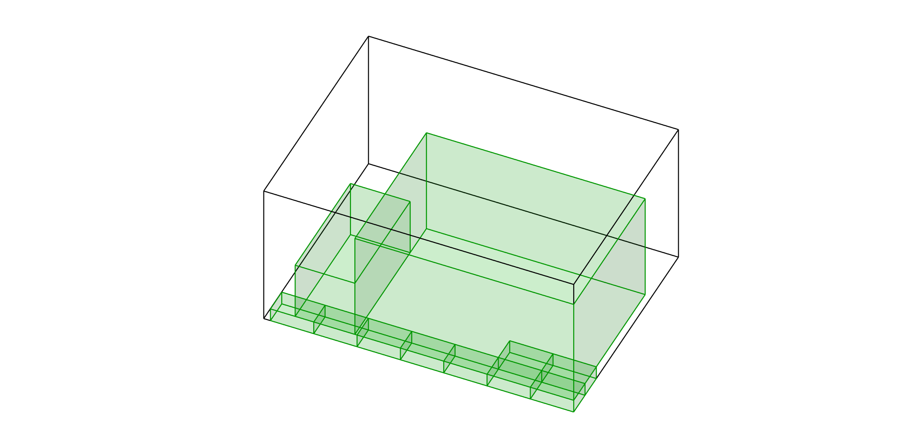

# Box Packing

Packs 3D boxes into a container.

## Inputs

| Parameter | Type | Access | Description |
| --- | --- | --- | --- |
| **Con** (C) | Geometry | list | Container to pack into |
| **Geo** (G) | Geometry | list | Geometry to pack |

## Outputs

| Parameter | Type | Description |
| --- | --- | --- |
| **Geo** (G) | Geometry | Packed geometry |
| **Tra** (T) | Transform | Packing transforms |

## Example

**Files to download:**

- [⬇ box_packing.ghx](files/bin_packing/box_packing.ghx)
- [⬇ box_packing_2d.ghx](files/bin_packing/box_packing_2d.ghx)

