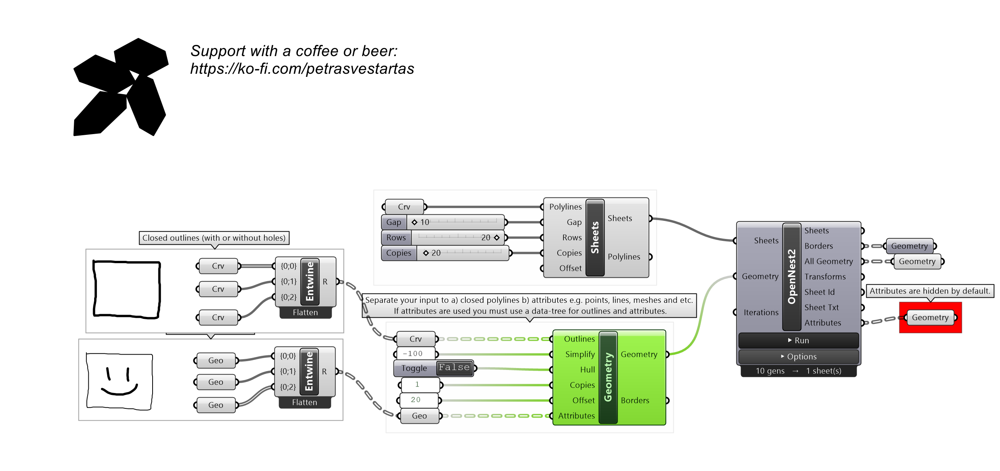
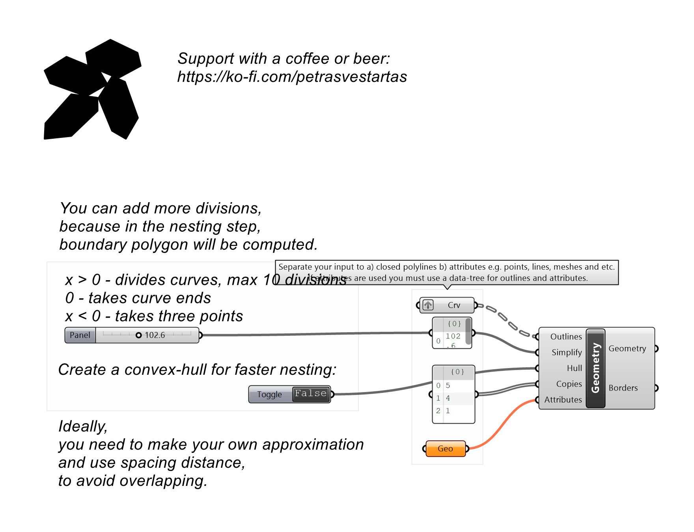
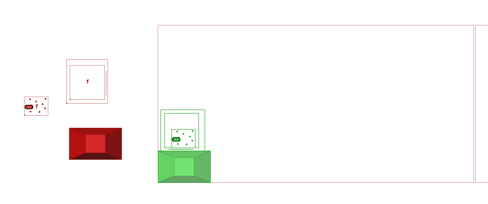
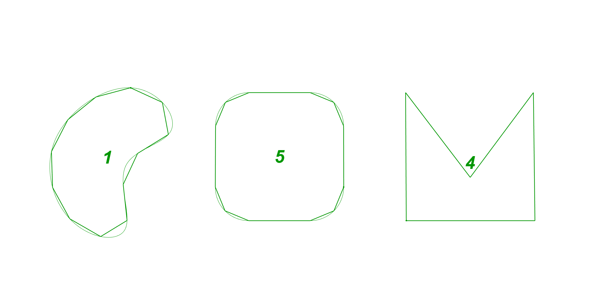

# Geometry

Prepares parts for nesting: separates outlines (with holes) from attached attributes; optional simplify, convex hull and copies.

## Inputs

| Parameter | Type | Access | Description |
| --- | --- | --- | --- |
| **Outlines** | Geometry | tree | Closed curves OR planar surfaces (cast per type internally). If geometries have holes, create a data-tree first.  Place each element into indivdual branch.  Otherwise the algoritm will try to order polylines by checking possible holes. |
| **Simplify** | Number | item | segment divisions  0 = KEEP ALL vertices (no simplification - best for nesting fine outlines)  x>0 divides by distance  x<0 max 3 points per sub-segment (merges colinear within 10deg) _Default: -100._ |
| **Hull** | Boolean | item | Replace each outline with its convex hull _Default: false._ |
| **Copies** | Integer | list | Number of copies per part |
| **Attributes** | Geometry | tree | Additional geometry: points, lines, surfaces, meshes...  Use data-tree, one list of additional geometry per branch.. |

## Outputs

| Parameter | Type | Description |
| --- | --- | --- |
| **Geometry** | Generic | Prepared parts ready for nesting |
| **Borders** | Curve | Outline border curves per part |

## Example

**Files to download:**

- [⬇ geometry.ghx](files/geometry/geometry.ghx)

