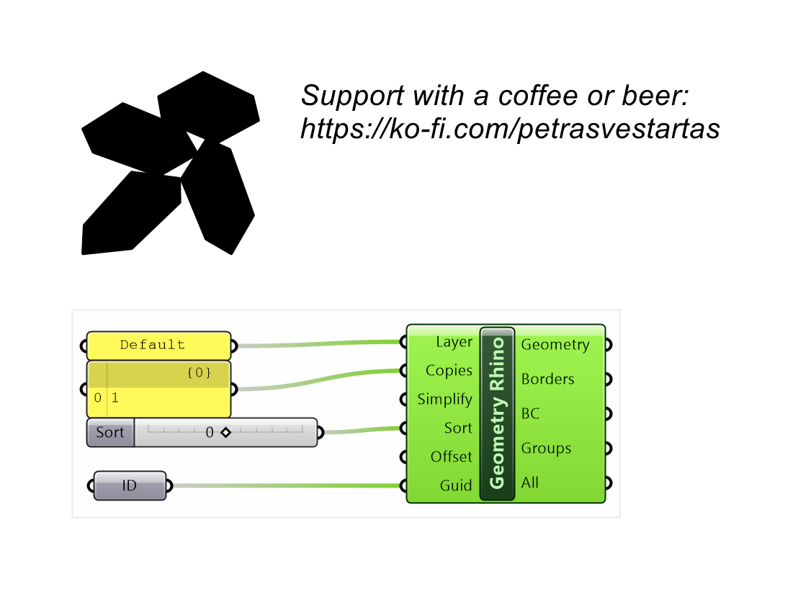
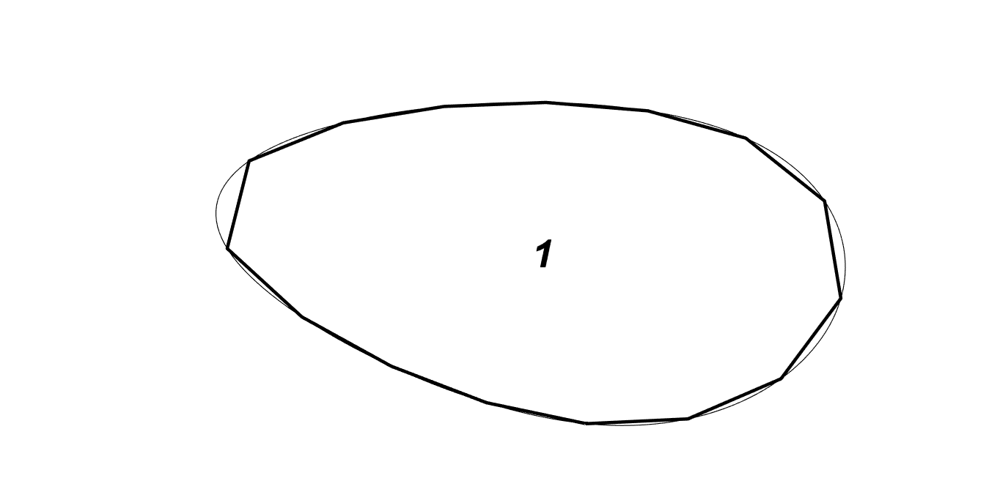

# Geometry (Rhino)

Builds nesting parts from referenced Rhino objects, separating outlines from attributes (text, curves) and sorting them automatically.

## Inputs

| Parameter | Type | Access | Description |
| --- | --- | --- | --- |
| **Layer** | Text | item | Boundary layer in Rhino you need to create to select objects. |
| **Copies** | Integer | list | Number of copies must be equal to tree branches, number of guids inputs is treated as a separate branch _Default: 1._ |
| **Simplify** | Number | list | Default parameter<0>, parameter<1>,  segment divisions (0 takes only ends, x>0 divides by distance,  x<0 max 3 points per sub-segment), compute only convex-hull from simplified polyline 0/1 _Default: 100, 0._ |
| **Sort** | Number | item | Sort polylines. _Default: 1._ |
| **Guid** | Generic | tree | Referenced geometry as guid (can be mesh, brep, curves in one list) |

## Outputs

| Parameter | Type | Description |
| --- | --- | --- |
| **Geometry** | Generic | Assembled nesting geometry to feed the solver |
| **Borders** | Curve | Outline curves grouped per part |
| **BC** | Curve | Convex-hull border curves per part |
| **Groups** | Integer | Object group indices per part |
| **All** | Geometry | All referenced geometry grouped per part |

## Example

**Files to download:**

- [⬇ rhino_objects.3dm](files/geometry_rhino/rhino_objects.3dm)
- [⬇ rhino_objects.ghx](files/geometry_rhino/rhino_objects.ghx)

