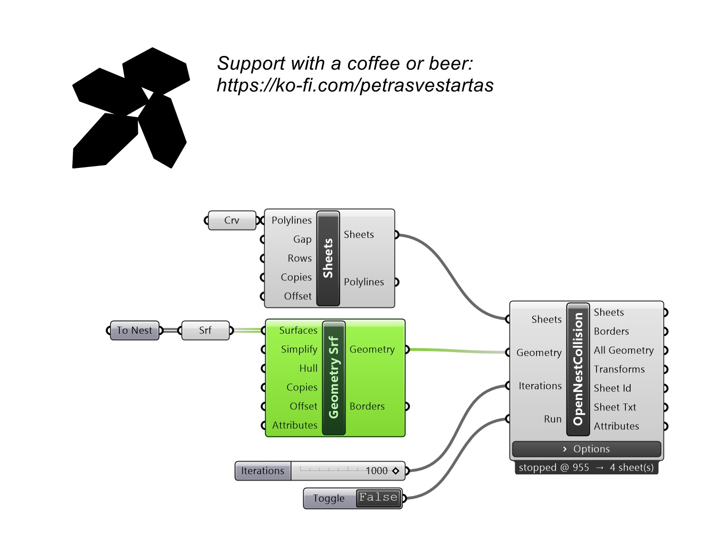
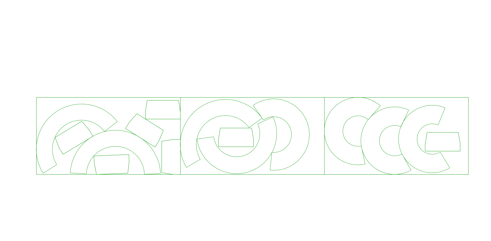

# Geometry (Surfaces)

Builds nesting parts from planar surfaces instead of curves; holes are read from the surface boundaries.

## Example

**Files to download:**

- [⬇ geometry_surface.ghx](files/geometry_srf/geometry_surface.ghx)

## Inputs

| Parameter | Type | Access | Description |
| --- | --- | --- | --- |
| **Surfaces** | Brep | list | Planar boundary surfaces.  If you want to nest multiple sheets partition surfaces into the data-tree. |
| **Simplify** | Number | item | segment divisions  0 takes only ends  x>0 divides by distance  x<0 max 3 points per sub-segment) _Default: -100._ |
| **Hull** | Boolean | item | Use the convex hull of each simplified outline. _Default: false._ |
| **Copies** | Integer | list | Number of copies per part. |
| **Attributes** | Geometry | list | Additional geometry: points, lines, surfaces, meshes...  Use data-tree, one list of additional geometry per branch.. |

## Outputs

| Parameter | Type | Description |
| --- | --- | --- |
| **Geometry** | Generic | Nesting parts ready for the solver. |
| **Borders** | Curve | Outline curves of each part. |
