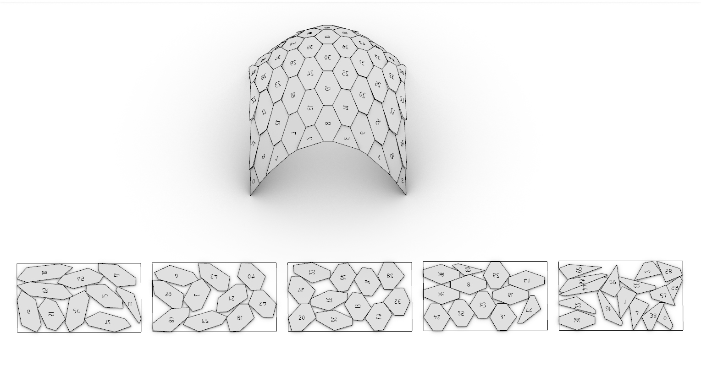

# Grasshopper 1

OpenNest's components run in **classic Grasshopper** — Rhino 8, and the classic editor that is still in
Rhino 9. Each component has its own tutorial with a downloadable example — see **Nesting**
([OpenNest2](opennest2.md), [OpenNest1](opennest1.md), [OpenNestCollision](opennest_collision.md)),
**Geometry & sheets**, and **Utilities** in the navigation.

The same components also run in [Grasshopper 2](grasshopper2.md) (the new editor in Rhino 9 WIP) — identical
inputs, outputs and behaviour.

!!! note "Rhino 6 and 7 are not supported"
    Only `rh8_0` and `rh9_0` Yak distributions are published, so the Rhino 7 Package Manager will never offer
    OpenNest — and every build of `opennest_2.gha`, `net48` included, compiles against the **Grasshopper 8**
    SDK. The `net48` payload exists for Rhino 8 running on .NET Framework 4.8, not for Rhino 7; nothing is
    built or tested against Rhino 6/7.

## Example files

[Download the Grasshopper 1 examples (.zip)](files/opennestexamplesgh1.zip){ .md-button .md-button--primary }

Unzip and open the example definitions in Grasshopper.
