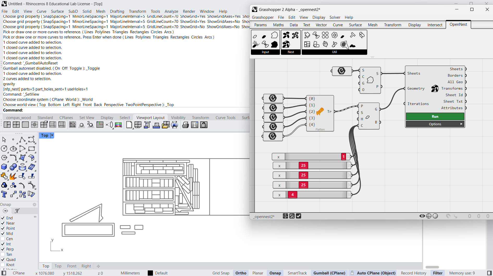
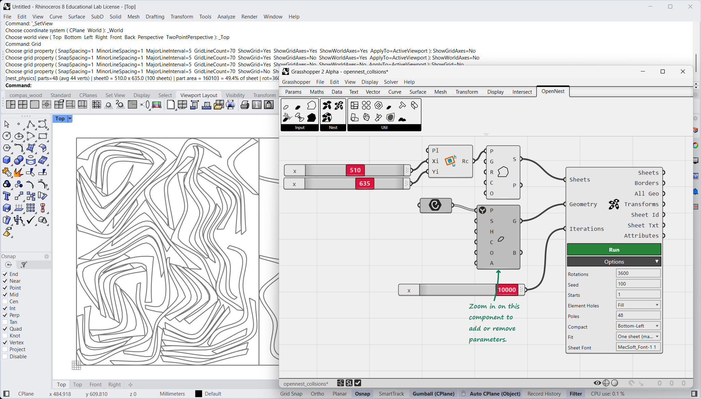
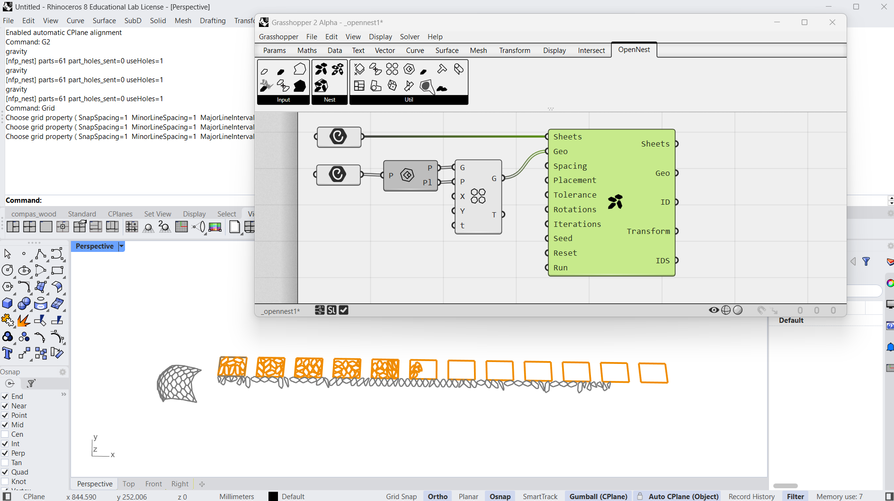

# Grasshopper 2

OpenNest runs in **Grasshopper 2** — the new node editor in **Rhino 8** — as well as in classic Grasshopper. The
components are **identical** to [Grasshopper 1](grasshopper1.md): same inputs, outputs and behaviour, so the same
component tutorials apply — **Nesting** ([OpenNest2](opennest2.md), [OpenNest1](opennest1.md),
[OpenNestCollision](opennest_collision.md)), **Geometry & sheets**, and **Utilities** (see the navigation).

The **OpenNest** tab appears in the Grasshopper 2 ribbon after installing the package — one install delivers the
Grasshopper 1 components, the Grasshopper 2 plug‑in, and the `OpenNest` Rhino command (Windows and macOS).

## Example files

[Download the Grasshopper 2 examples (.zip)](files/opennest_examples_gh2.zip){ .md-button .md-button--primary }

Unzip and open the example definitions in Grasshopper 2 (Rhino 8).
