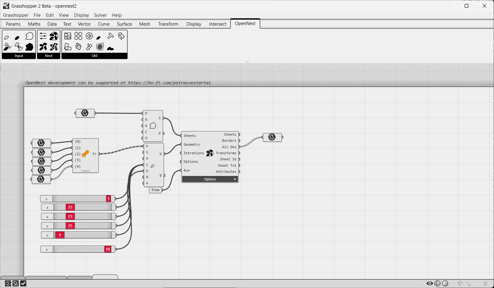
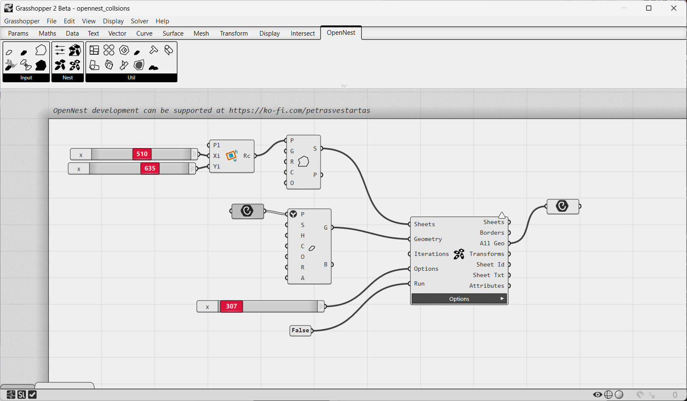
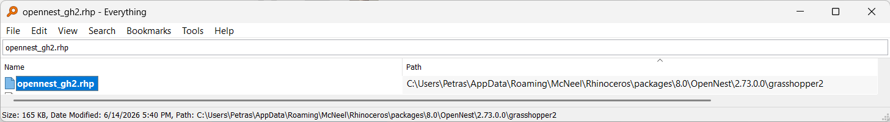
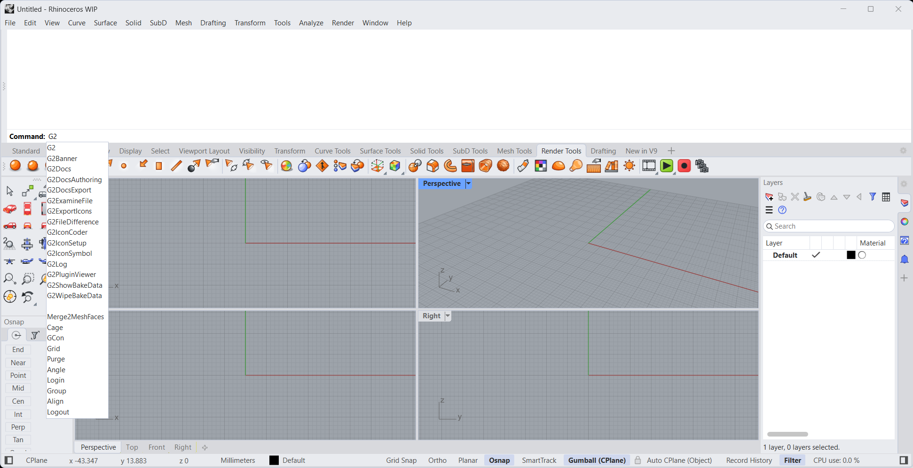
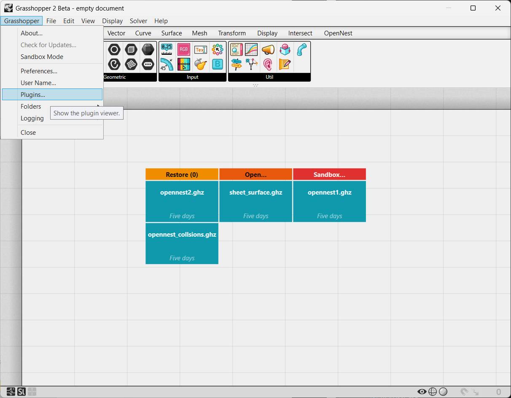
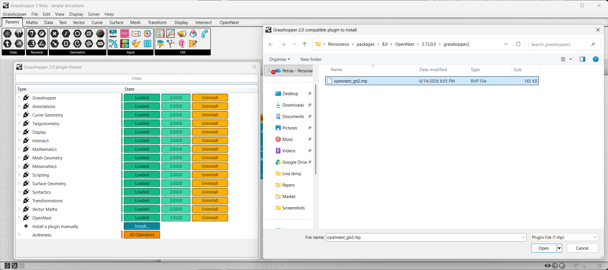

# Grasshopper 2

OpenNest runs in **Grasshopper 2** — the new node editor shipped in **Rhino 9 WIP**. The components are
**identical** to [Grasshopper 1](grasshopper1.md): same inputs, outputs and behaviour, so the same component
tutorials apply — **Nesting** ([OpenNest2](opennest2.md), [OpenNest1](opennest1.md),
[OpenNestCollision](opennest_collision.md)), **Geometry & sheets**, and **Utilities** (see the navigation).

## Installation (Rhino 9 WIP)

Grasshopper 2 is available only on Rhino 9 WIP, and you need to install it manually. But when you install
OpenNest through the package manager, you need to manually load the `opennest_gh2.rhp` file from the Plug-ins —
you can find this file by searching on your PC (I use the [Everything](https://www.voidtools.com/) tool):

The Package Manager auto-installs the Grasshopper 1 components and the `OpenNest` Rhino command (on Rhino 8 and
Rhino 9). The Grasshopper 2 plug-in ships in the package's `grasshopper2/` subfolder as a manual-load `.rhp`
(loading it through Rhino's Plug-in Manager is not supported — load it from inside Grasshopper 2 as shown above).

## Example files

[Download the Grasshopper 2 examples (.zip)](files/opennest_examples_gh2.zip){ .md-button .md-button--primary }

Unzip and open the example definitions in Grasshopper 2 (Rhino 9 WIP).
