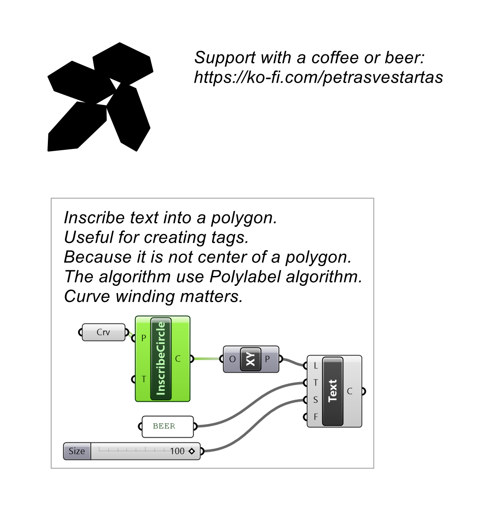
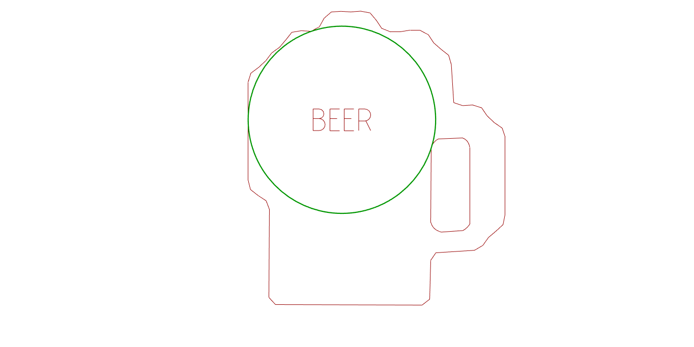

# Inscribed Circle

Finds the largest circle that fits inside each closed polyline.

## Example

**Files to download:**

- [⬇ inscribed_circle.ghx](files/inscribe_circle/inscribed_circle.ghx)

## Inputs

| Parameter | Type | Access | Description |
| --- | --- | --- | --- |
| **Polylines** (P) | Curve | list | Closed polylines to inscribe circles in |
| **Tolerance** (T) | Number | item | Precision of the fit _Default: 10._ |

## Outputs

| Parameter | Type | Description |
| --- | --- | --- |
| **Circle** (C) | Circle | Largest inscribed circle |
