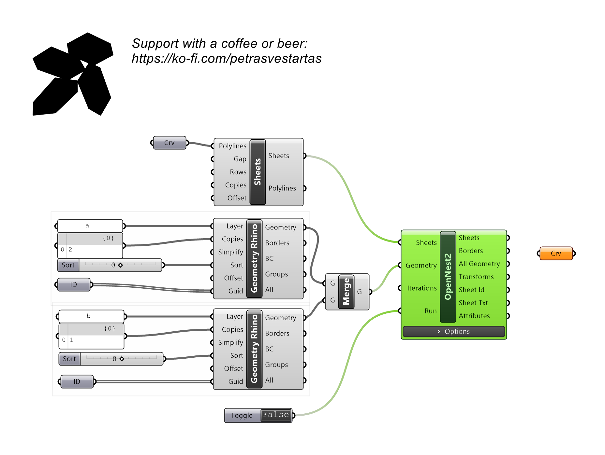
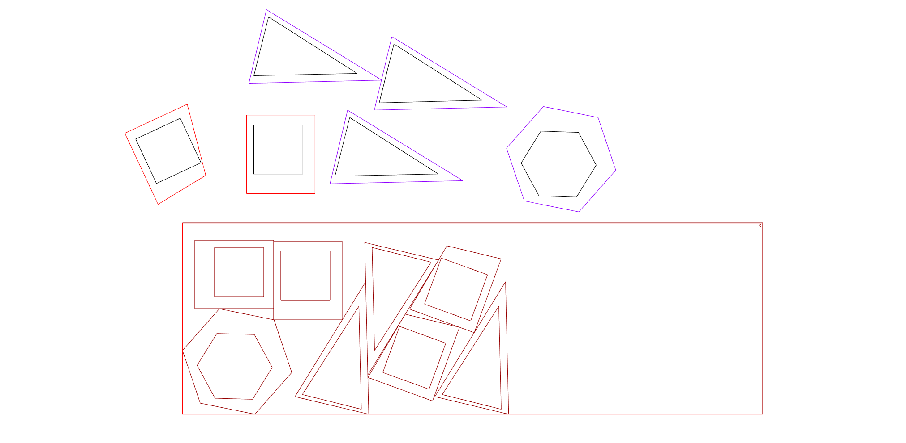

# Merge

Combines two OpenNest Geometry streams into one.

## Example

**Files to download:**

- [⬇ merge.3dm](files/merge/merge.3dm)
- [⬇ merge.ghx](files/merge/merge.ghx)

## Inputs

| Parameter | Type | Access | Description |
| --- | --- | --- | --- |
| **Geometry** (G) | Generic | list | OpenNest Geometry. |
| **Geometry** (G) | Generic | list | OpenNest Geometry. |

## Outputs

| Parameter | Type | Description |
| --- | --- | --- |
| **Geometry** (G) | Generic | Merged Geometry. |
