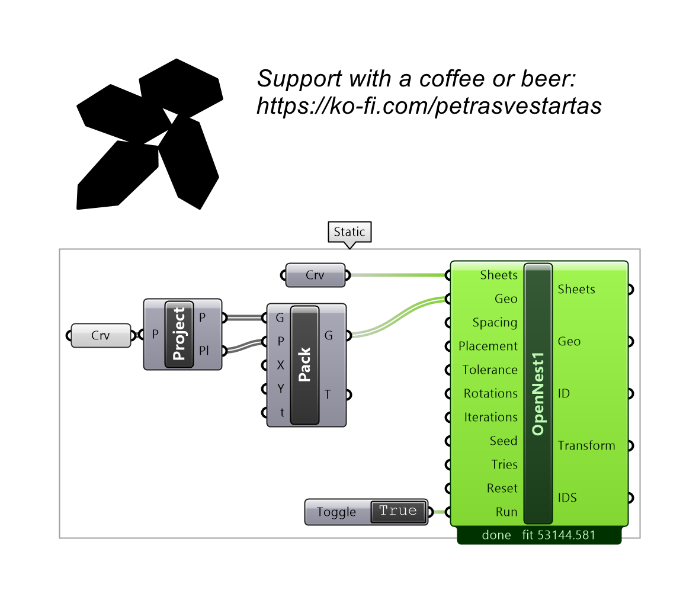
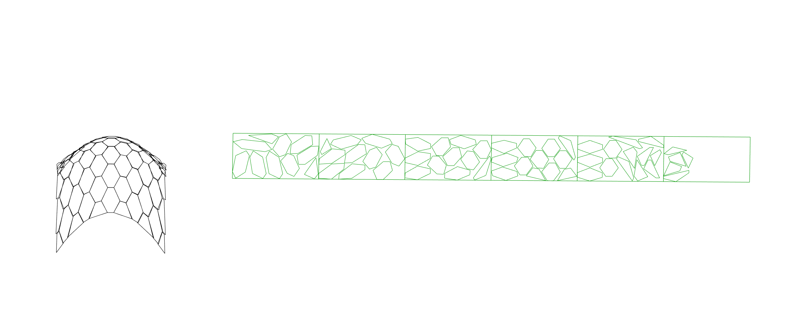

# OpenNest1

Nests parts onto sheets with the no-fit-polygon solver (no attributes). Takes curves or surfaces directly; supports multi-start Tries and a live preview.

## Inputs

| Parameter | Type | Access | Description |
| --- | --- | --- | --- |
| **Sheets** | Geometry | list | Sheets — closed planar surfaces (outer + holes) or closed curves. A single sheet is auto-copied so parts can overflow onto more. |
| **Geo** | Geometry | list | Parts to nest — closed curves or planar surfaces. |
| **Spacing** | Number | item | Gap to keep between placed parts. _Default: 1._ |
| **Placement** | Integer | item | Placement strategy index. _Default: 1._ |
| **Tolerance** | Number | item | Curve simplification tolerance. _Default: 0.1._ |
| **Rotations** | Integer | item | Number of rotation angles to try per part. _Default: 4._ |
| **Iterations** | Integer | item | Number of solver iterations. _Default: 1._ |
| **Seed** | Integer | item | Random seed for reproducible results. _Default: 1._ |
| **Tries** | Integer | item | Multi-start: run this many attempts (seed, seed+1, …) and keep the TIGHTEST layout. 1 = single run; 4–8 reliably beats run-to-run variance. The live preview shows the current try; ESC stops the sweep and keeps the best so far. _Default: 1._ |
| **Reset** | Boolean | item | Reset the solver and clear results. _Default: true._ |
| **Run** | Boolean | item | Start the nesting solve. _Default: false._ |

## Outputs

| Parameter | Type | Description |
| --- | --- | --- |
| **Sheets** | Curve | Sheet outlines used for nesting. |
| **Geo** | Geometry | Nested parts placed on the sheets. |
| **ID** | Integer | Polygon id number |
| **Transform** | Transform | Placement transform per part. |
| **IDS** | Integer | Sheet id number |

## Example

**Files to download:**

- [⬇ opennest1.ghx](files/opennest1/opennest1.ghx)

