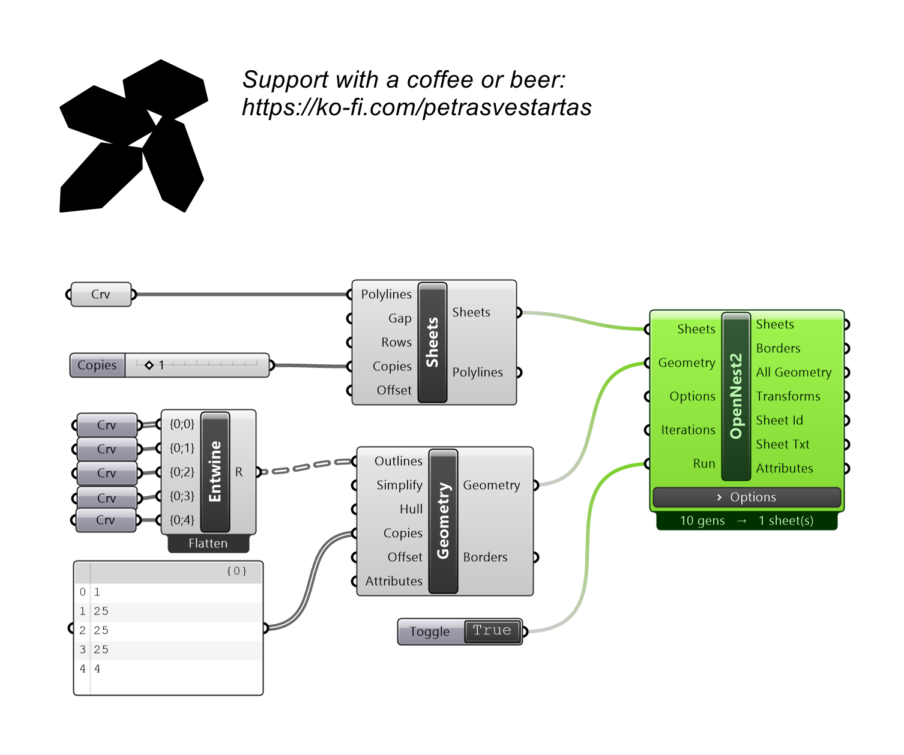
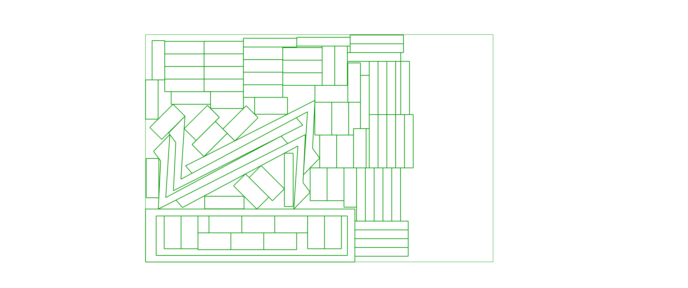

# OpenNest2

Nests parts onto sheets with the no-fit-polygon genetic solver, keeping each part's attributes. Feed it the Sheets and Geometry components.

## Example

**Files to download:**

- [⬇ opennest2.ghx](files/opennest2/opennest2.ghx)

## Inputs

| Parameter | Type | Access | Description |
| --- | --- | --- | --- |
| **Sheets** | Generic | item | From OpenNest tab, use component Sheets. |
| **Geometry** | Generic | item | From OpenNest tab, use component Geometry. |
| **Iterations** | Integer | item | GA generations to evolve. Each generation evaluates the whole population and keeps the best, so the result improves over generations. ~10-40 typical (a live orange preview tightens as it runs; press ESC to stop and keep the best). Pair with the 'population' option (default 10). _Default: 10._ |

## Outputs

| Parameter | Type | Description |
| --- | --- | --- |
| **Sheets** | Curve | Polylines representing sheets. |
| **Borders** | Curve | Placed part outline curves. |
| **All Geo** (All Geometry) | Geometry | All placed geometry, grouped per sheet. |
| **Transforms** | Transform | Move/rotate transform placing each part. |
| **Sheet Id** | Integer | Sheet index each part landed on. |
| **Sheet Txt** | Curve | Sheet-number labels as text curves. |
| **Attributes** | Geometry | Attribute geometry carried with each part. |

## Options

On-canvas settings shown on the component body (zoom in on the component to reveal the widgets, or right-click). They tune *how* the genetic solver packs; the three input ports above are *what* it packs.

| Option | Type | Default | Range / Choices | Description |
| --- | --- | --- | --- | --- |
| **Rotations** | Number | 8 | 1 – 3600 | Orientations each part may try (360°/n). |
| **Packing** | Choice | Gravity | Box · Gravity · Squeeze · Bottom Left | Placement strategy. **Bottom Left** packs each part into the lowest-then-leftmost feasible spot. |
| **Spacing** | Number | 0.0 | 0 – 1000 | Gap kept between parts (model units). |
| **Seed** | Number | 30 | 0 – 100000 | Random seed (same seed = same result). |
| **Mutation** | Number | 10 | 0 – 100 | GA mutation rate. |
| **Population** | Number | 10 | 1 – 100000 | GA population size — candidates evaluated per generation. |
| **All Rotations** | Choice | On | Off · On | Try every orientation per part for the tightest packing. Capped at 8 orientations so a large **Rotations** value can't hang the solver. |
| **Element Holes** | Choice | Fill | Off · Fill | Nest smaller parts **inside** larger parts' holes. |
| **Sheet Font** | Text | `MecSoft_Font-1 1` | — | Sheet-number label: font name + text size. |
