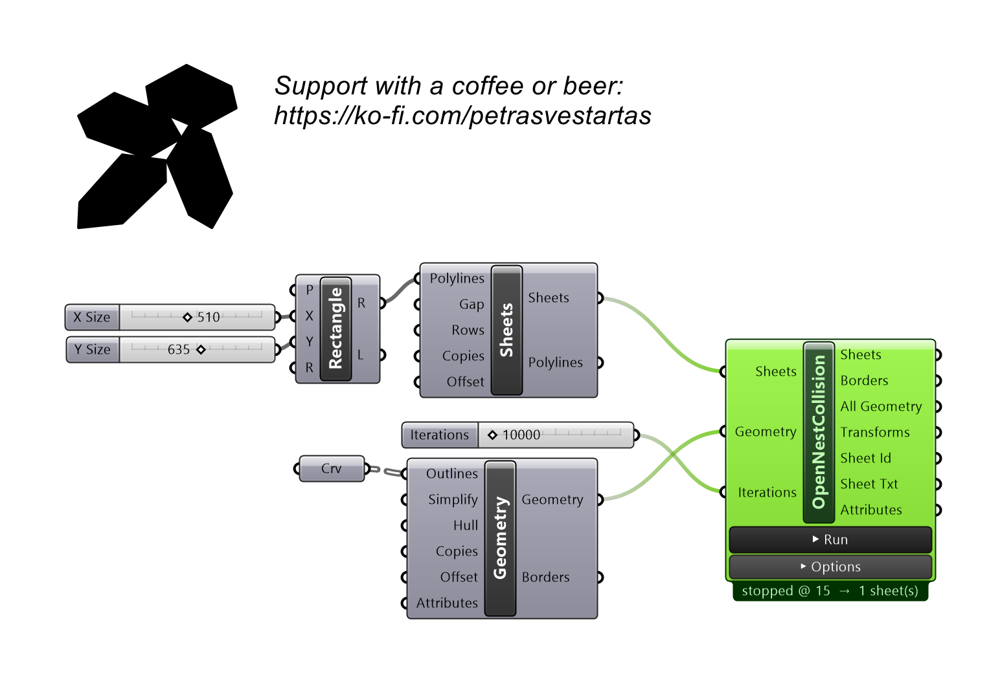
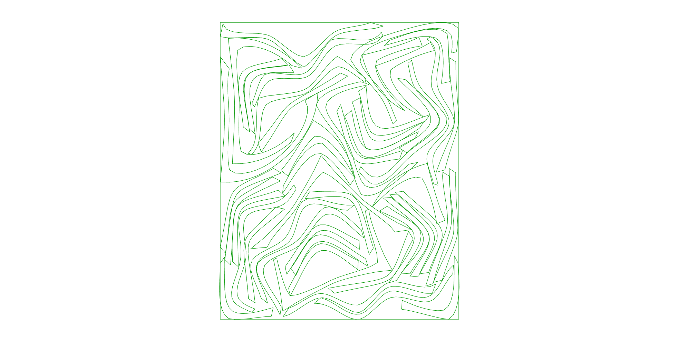

# OpenNestCollision

Nests parts onto sheets with the physics collision solver - packs tightly and can fill part cavities. Feed it the Sheets and Geometry components.

!!! tip "Recommended settings (single start, one sheet)"
    **Iterations 4000**, **Rotations 3600**, **Starts 1**, **Poles 48**, **Compact Bottom-Left**. These are the
    defaults. If a run spills onto a second sheet, change the **Seed** and run again. (Fewer Poles is faster but
    can pack worse; a single high-rotation start is what closes the pack — no multi-start needed.)

## Example

**Files to download:**

- [⬇ opennestcollision.ghx](files/opennest_collision/opennestcollision.ghx)

## Inputs

| Parameter | Type | Access | Description |
| --- | --- | --- | --- |
| **Sheets** | Generic | item | From OpenNest tab, use component Sheets. |
| **Geometry** | Generic | item | From OpenNest tab, use component Geometry. |
| **Options** | Text | list | Optional list of "key value" option strings — wire the **NestOptions** component here. Each line overrides the matching on-canvas option row below; unwired keys keep their on-canvas value. |
| **Iterations** | Integer | item | Relaxation rounds; higher packs tighter but is slower. ~4000 = the tight all-on-one-sheet pack; lower for a quick rough preview. _Default: 4000._ |
| **Run** | Boolean | item | Wire a Boolean Toggle. TRUE = solve now and re-solve when an input changes (background thread, live preview); FALSE = hold the last result. ESC also stops a running solve. _Default: false._ |

## Outputs

| Parameter | Type | Description |
| --- | --- | --- |
| **Sheets** | Curve | Sheet outline polylines used for nesting. |
| **Borders** | Curve | Placed part outline curves. |
| **All Geo** (All Geometry) | Geometry | All placed part geometry. |
| **Transforms** | Transform | Placement transforms for each part. |
| **Sheet Id** | Integer | Index of the sheet each part landed on. |
| **Sheet Txt** | Curve | Sheet-number label curves. |
| **Attributes** | Geometry | Per-part attribute geometry. |

## Options

On-canvas settings shown on the component body (zoom in on the component to reveal the widgets, or right-click). They tune *how* the solver packs; the three input ports above are *what* it packs.

| Option | Type | Default | Range / Choices | Description |
| --- | --- | --- | --- | --- |
| **Rotations** | Number | 3600 | 1 – 3600 | Orientations each part may try. More = tighter pack, slower. |
| **Seed** | Number | 100 | 0 – 100000 | Random seed. Change it if a run spills onto a 2nd sheet, then re-run. |
| **Starts** | Number | 1 | 1 – 64 | Multi-start: run this many seeds and keep the densest; stops early at the first single-sheet result. 1 = single run (recommended with high Rotations). |
| **Element Holes** | Choice | Fill | Off · Fill · Fill First | Nest small **parts** into larger parts' holes. **Fill** = after the main nest; **Fill First** = pre-pack into holes before nesting (sometimes tighter). Sheet holes are always kept clear automatically. |
| **Poles** | Number | 48 | 4 – 64 | Inscribed circles per part used for collision tests. More = more accurate (cleaner pack); fewer = faster but can pack worse. |
| **Compact** | Choice | Bottom-Left | Off · Bottom-Left · Multi | Post-pack tightening slide. **Bottom-Left** slides parts down-then-left; **Multi** slides from several directions. |
| **Fit** | Choice | All parts (fewest sheets) | One sheet (max fill) · All parts (fewest sheets) | **All parts** = use as many sheets as needed so nothing is left off (default). **One sheet** = fill a single sheet as full as possible; parts that don't fit are placed **outside**. |
| **Sheet Font** | Text | `MecSoft_Font-1 1` | — | Sheet-number label: font name + text size. |
