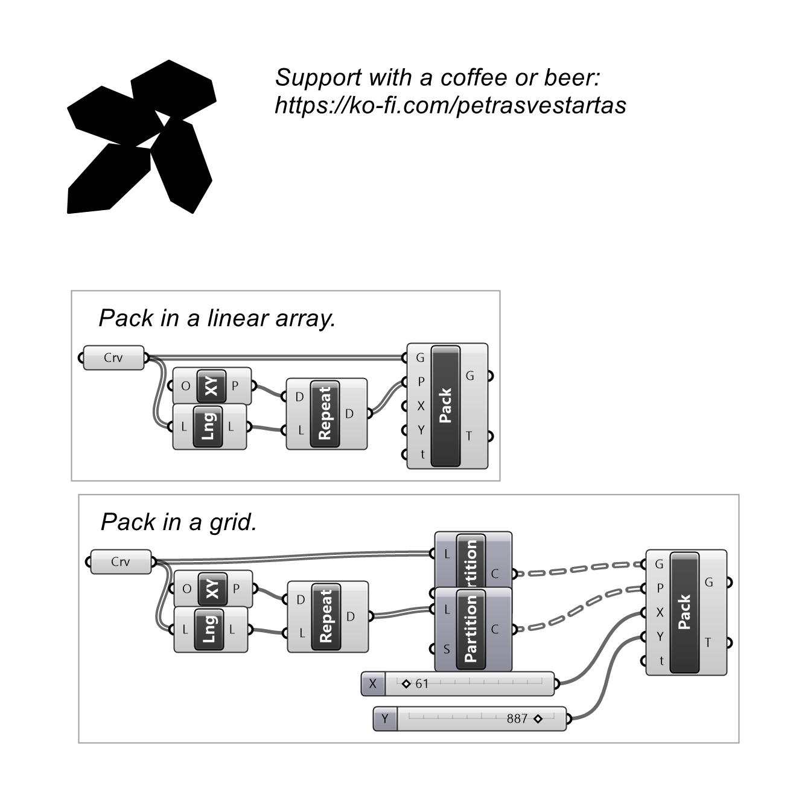
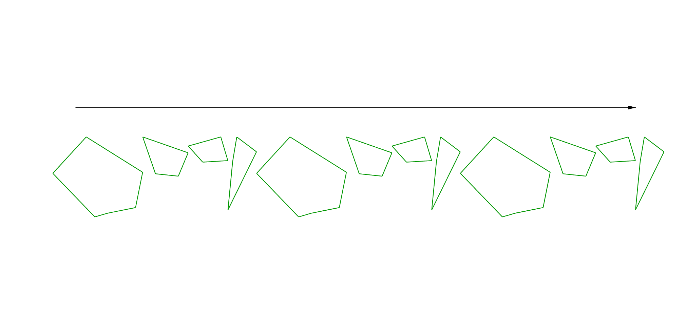

# Pack Objects

Lays objects out in a row, orienting each from 3D to 2D with a chosen spacing.

## Inputs

| Parameter | Type | Access | Description |
| --- | --- | --- | --- |
| **Geo** (G) | Geometry | tree | Objects to pack |
| **Plane** (P) | Plane | tree | Base plane to orient from 3D to 2D |
| **X** | Number | item | Offset Distance, negative number will not include bbox _Default: 1._ |
| **Y** | Number | item | Offset Distance, negative number will not include bbox _Default: 1._ |
| **tolerance** (t) | Number | item | Rotates objects by t in radians until Math.Pi and takes one with min bounding box _Default: 0._ |

## Outputs

| Parameter | Type | Description |
| --- | --- | --- |
| **Geo** (G) | Geometry | Packed objects |
| **Transformation** (T) | Transform | Transform applied to each object |

## Example

**Files to download:**

- [⬇ pack_objects.ghx](files/pack/pack_objects.ghx)

