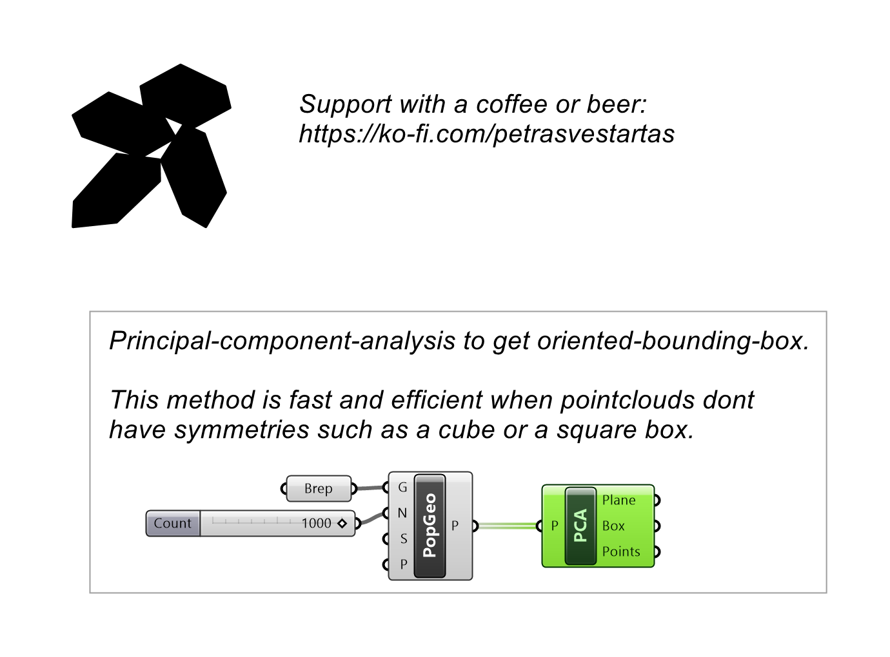
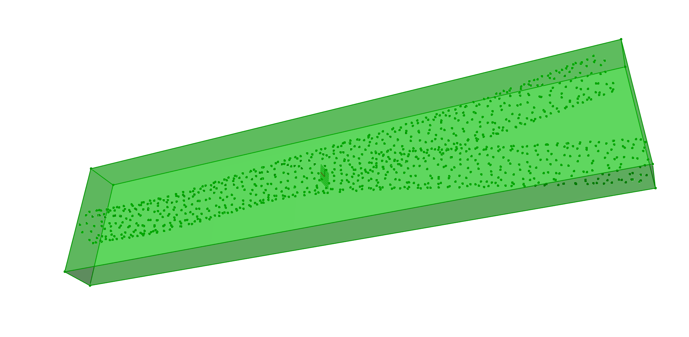

# Principal Component Analysis

Finds the principal axes of a point set and returns the aligned plane and bounding box.

## Inputs

| Parameter | Type | Access | Description |
| --- | --- | --- | --- |
| **Points** (P) | Point | list | Point set to analyze |

## Outputs

| Parameter | Type | Description |
| --- | --- | --- |
| **P** (Plane) | Plane | Principal-axis aligned plane |
| **B** (Box) | Box | Oriented bounding box |
| **Pt** (Points) | Point | Bounding box corner points |

## Example

**Files to download:**

- [⬇ principal_component_analysis.ghx](files/pca/principal_component_analysis.ghx)

