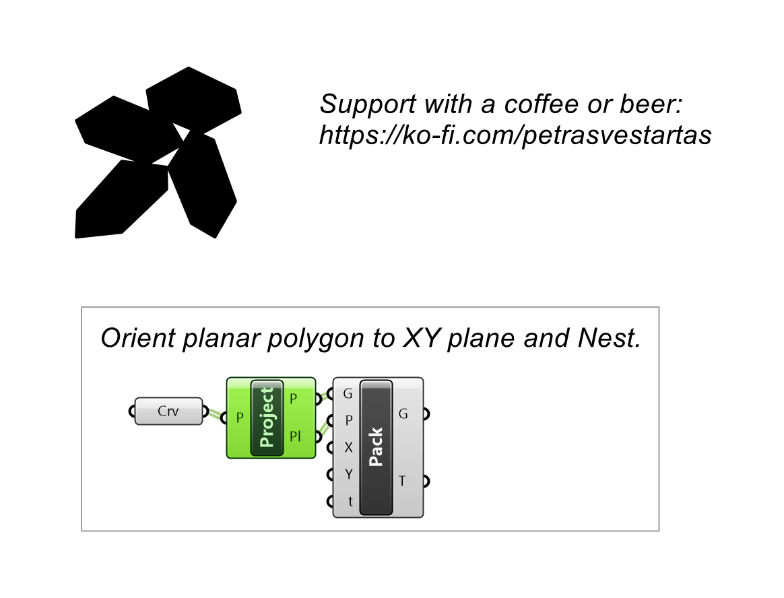
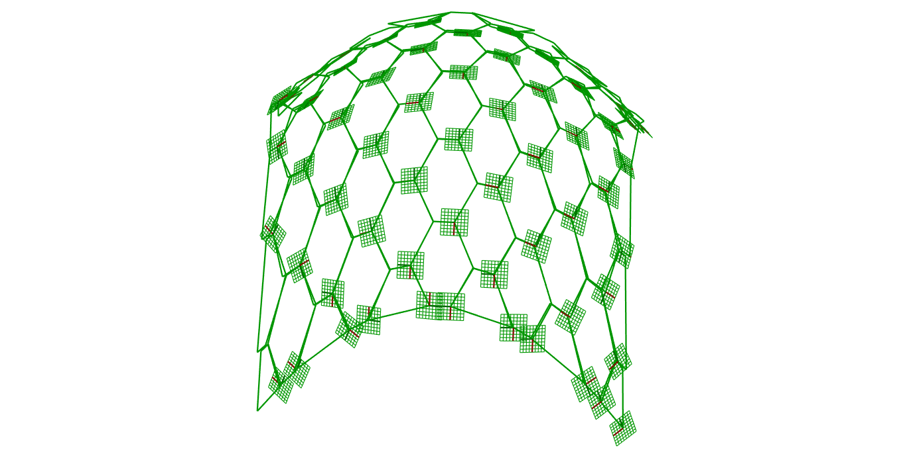

# Project to Plane

Projects a polyline onto its best-fit plane and returns that plane.

## Inputs

| Parameter | Type | Access | Description |
| --- | --- | --- | --- |
| **Polyline** (P) | Curve | item | Polyline to project |

## Outputs

| Parameter | Type | Description |
| --- | --- | --- |
| **Polyline** (P) | Curve | Projected polyline |
| **Plane** (Pl) | Plane | Best-fit plane |

## Example

**Files to download:**

- [⬇ project_to_plane.ghx](files/project/project_to_plane.ghx)

