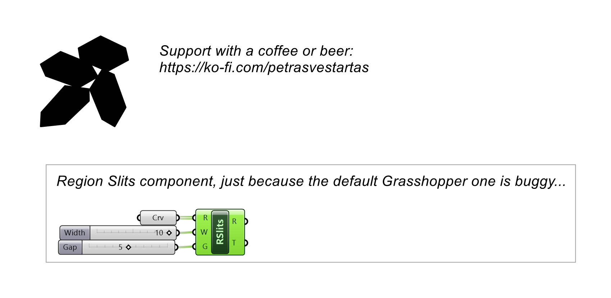
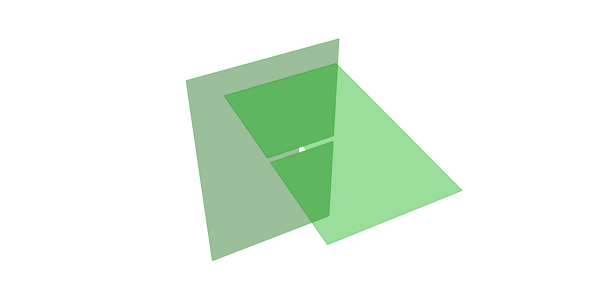

# Region Slits

Cuts interlocking slits where planar regions meet (a fixed version of the native component).

## Example

**Files to download:**

- [⬇ region_slits.ghx](files/region_slits/region_slits.ghx)

## Inputs

| Parameter | Type | Access | Description |
| --- | --- | --- | --- |
| **Regions** (R) | Curve | list | Planar regions to intersect |
| **Width** (W) | Number | item | Width of slits _Default: 0._ |
| **Gap** (G) | Number | item | Additional gap size at slit meeting points _Default: 0._ |

## Outputs

| Parameter | Type | Description |
| --- | --- | --- |
| **Regions** (R) | Surface | Regions with slits |
| **Topology** (T) | Integer | Slit topology |
