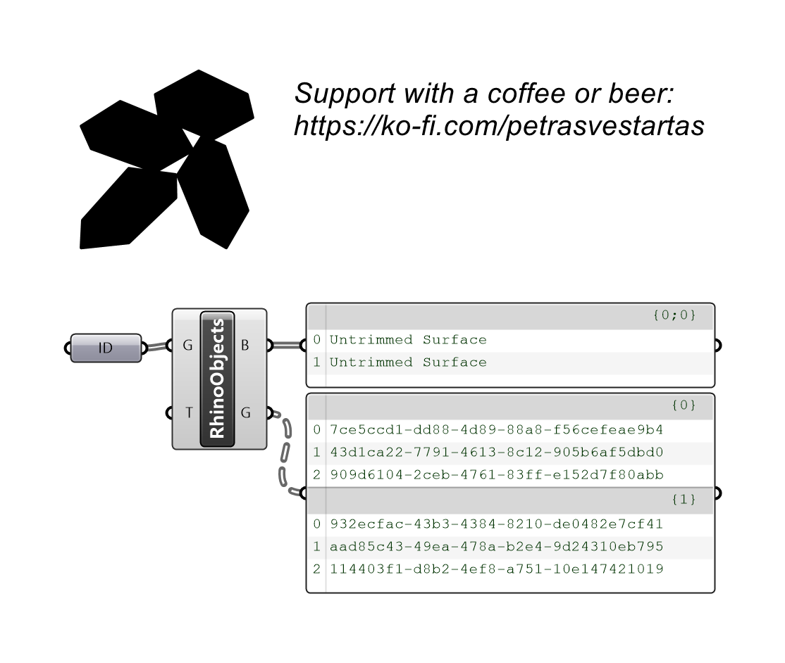
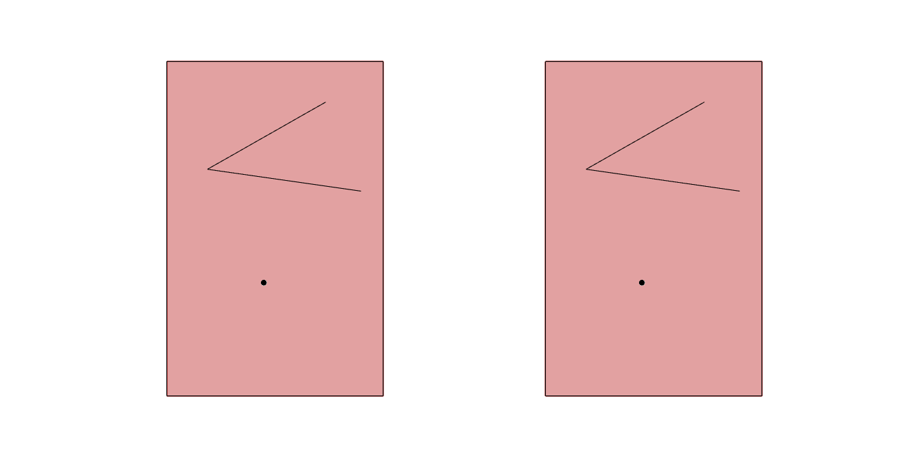

# Rhino Objects

Reads referenced Rhino objects, with attributes such as text, into planar Breps for nesting.

## Example

**Files to download:**

- [⬇ rhino_objects.3dm](files/rhino_objects/rhino_objects.3dm)
- [⬇ rhino_objects.ghx](files/rhino_objects/rhino_objects.ghx)

## Inputs

| Parameter | Type | Access | Description |
| --- | --- | --- | --- |
| **Geometry as guid** (G) | Generic | tree | Referenced geometry as guid (can be mesh, brep, curves in one list) |
| **T** | Number | item | Tolerance _Default: 0.01._ |

## Outputs

| Parameter | Type | Description |
| --- | --- | --- |
| **Breps** (B) | Brep | Planar Breps |
| **Geometry as guid** (G) | Generic | Referenced geometry as guid (can be mesh, brep, curves in one list) |
