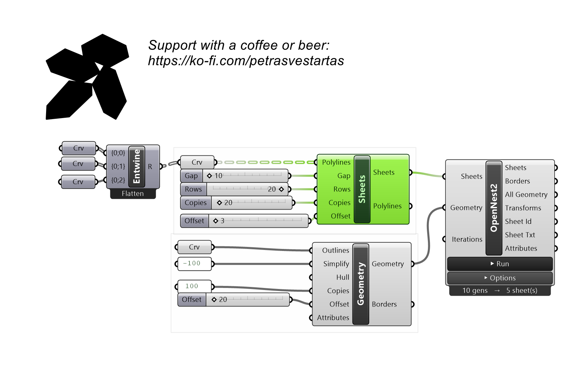
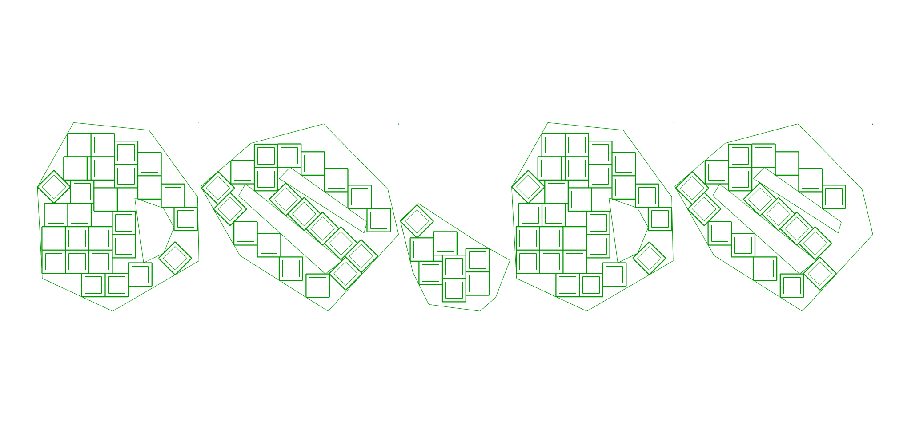

# Sheets

Defines the sheets to nest onto (with optional holes) from closed polylines; supports gap, rows and copies.

## Inputs

| Parameter | Type | Access | Description |
| --- | --- | --- | --- |
| **Polylines** | Curve | tree | Closed sheet polylines, with optional holes. |
| **Gap** | Number | list | Gap between sheets. _Default: 0.1._ |
| **Rows** | Number | list | Number of sheets per row before partitioning. |
| **Copies** | Number | item | Number of copies of the same sheet. |

## Outputs

| Parameter | Type | Description |
| --- | --- | --- |
| **Sheets** | Generic | OpenNest nest_sheets data type. |
| **Polylines** | Curve | Generated sheet outline polylines. |

## Example

**Files to download:**

- [⬇ sheets.ghx](files/sheets/sheets.ghx)

