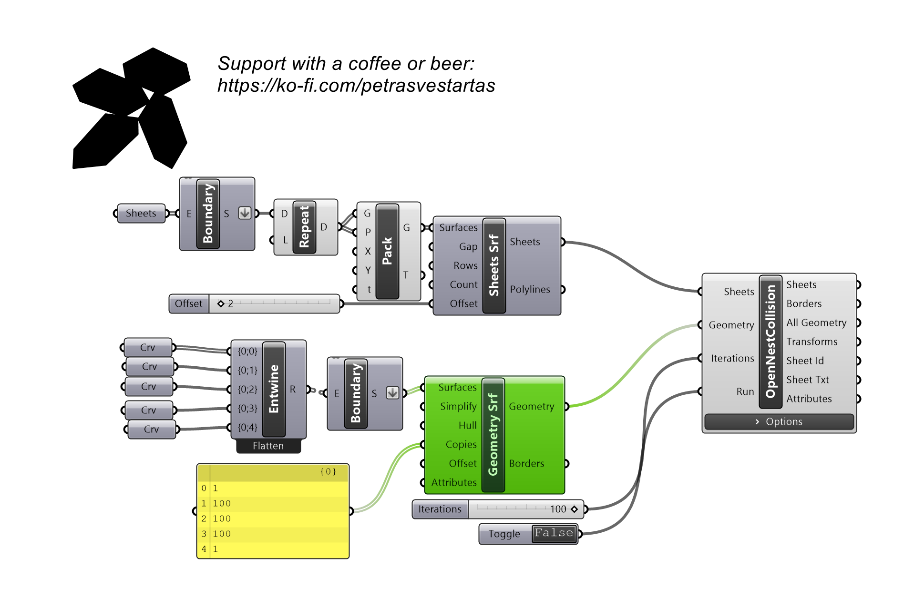
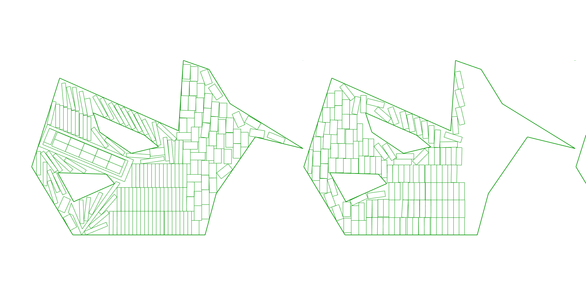

# Sheets (Surfaces)

Defines the sheets to nest onto from planar surfaces instead of polylines; holes come from the surface boundaries.

## Example

**Files to download:**

- [⬇ sheet_surface.ghx](files/sheets_surfaces/sheet_surface.ghx)

## Inputs

| Parameter | Type | Access | Description |
| --- | --- | --- | --- |
| **Surfaces** | Brep | list | Planar surfaces with optional holes. |
| **Gap** | Number | list | Gap between sheets. _Default: 0.1._ |
| **Rows** | Number | list | Number of sheets per row; partitioned if exceeded. |
| **Count** | Number | list | Number of copies of the same sheet. |

## Outputs

| Parameter | Type | Description |
| --- | --- | --- |
| **Sheets** | Generic | OpenNest nest_sheets data type. |
| **Polylines** | Curve | Sheet boundary polylines. |
