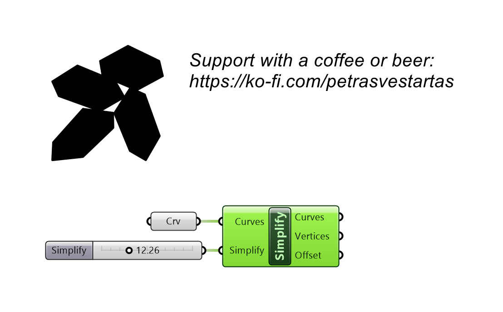
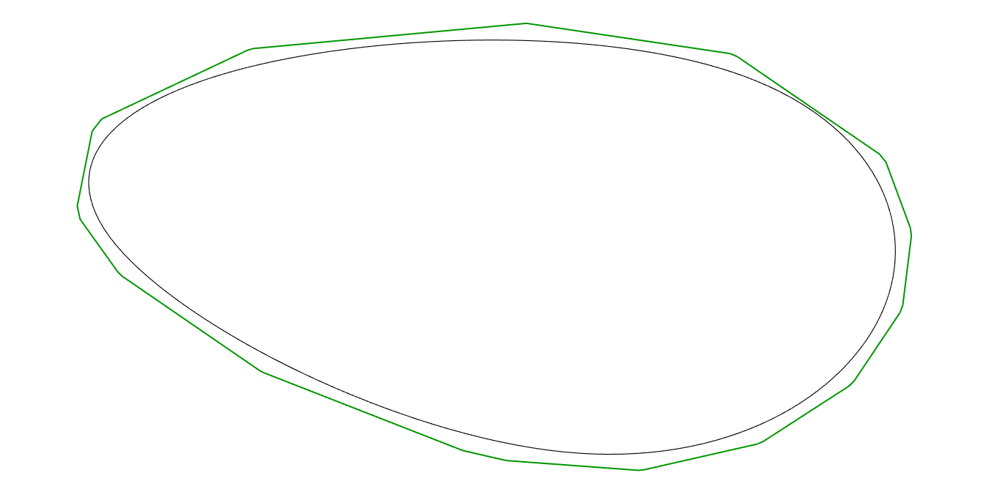

# Simplify

Reduces a closed curve's vertex count, auto-offsetting outward just enough that the original stays inside - so nested parts never overlap.

## Inputs

| Parameter | Type | Access | Description |
| --- | --- | --- | --- |
| **Curves** | Curve | list | Closed curves to simplify. |
| **Simplify** | Number | item | Simplification amount (Douglas-Peucker distance, model units): how much detail to drop. Bigger = fewer vertices. The outward offset needed to keep the original enclosed is computed AUTOMATICALLY (always <= this value) and reported on the Offset output. 0 = clean only (no reduction). _Default: 0.5._ |

## Outputs

| Parameter | Type | Description |
| --- | --- | --- |
| **Curves** | Curve | Simplified closed polylines (each GUARANTEED to contain its original). |
| **Vertices** | Integer | Vertex count of each simplified curve. |
| **Offset** | Number | The outward distance auto-applied to each curve so the original stays inside (model units). 0 = none needed. |

## Example

**Files to download:**

- [⬇ simplify.ghx](files/simplify/simplify.ghx)

