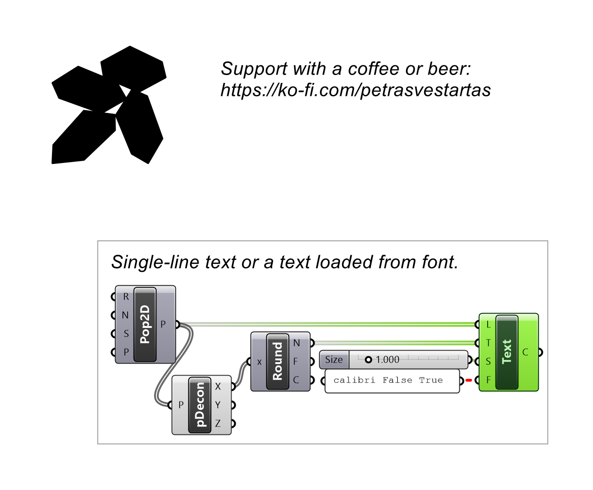
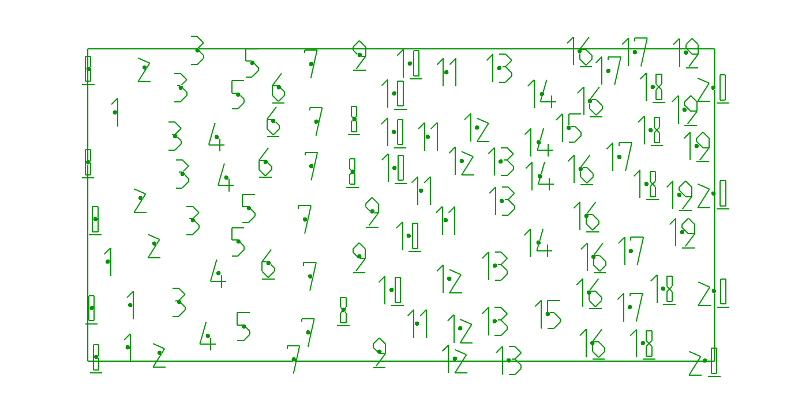

# Text

Builds text outlines as curves for laser-cutting or milling.

## Example

**Files to download:**

- [⬇ text.ghx](files/text/text.ghx)

## Inputs

| Parameter | Type | Access | Description |
| --- | --- | --- | --- |
| **Location** (L) | Plane | item | Location and orientation of the text |
| **Text** (T) | Text | item | Text to display |
| **Size** (S) | Number | item | Size of the text _Default: 1._ |
| **Font** (F) | Text | item | Font, if nothing is supplied the most optimal is used   for bold italic -> FontName True True   for bold -> FontName True False |

## Outputs

| Parameter | Type | Description |
| --- | --- | --- |
| **Curves** (C) | Curve | Text as curves |
