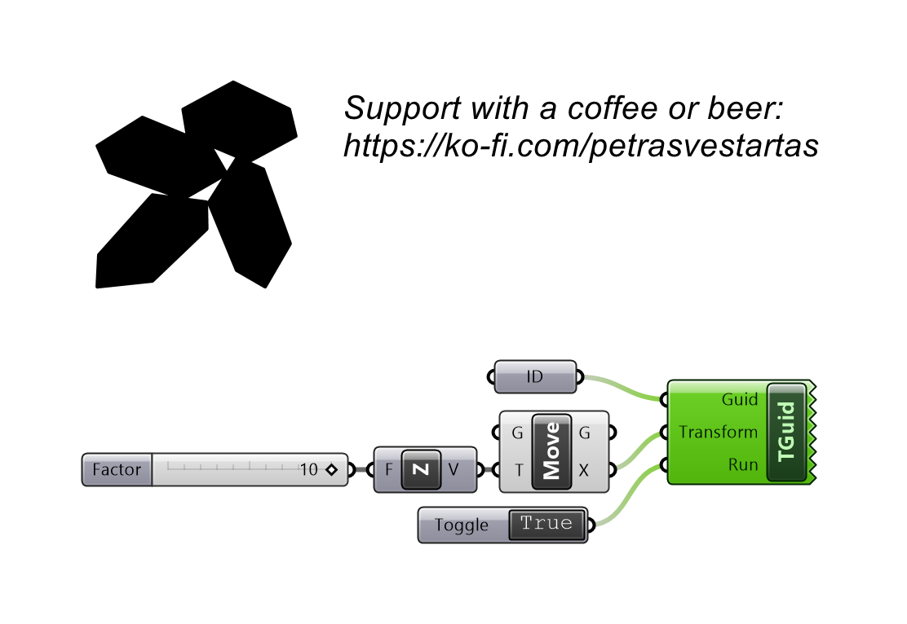
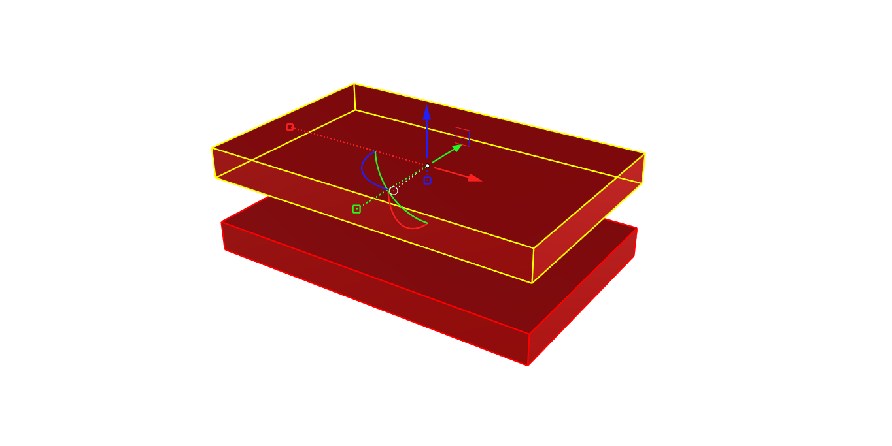

# Transform Object

Transforms a referenced Rhino object in place, keeping all of its properties.

## Example

**Files to download:**

- [⬇ transform_object.ghx](files/transform_guid/transform_object.ghx)

## Inputs

| Parameter | Type | Access | Description |
| --- | --- | --- | --- |
| **Guid** | Generic | item | Referenced geometry as guid |
| **Transform** | Transform | item | Transformation to apply to the object |
| **Run** | Boolean | item | Set to true to apply the transform |
