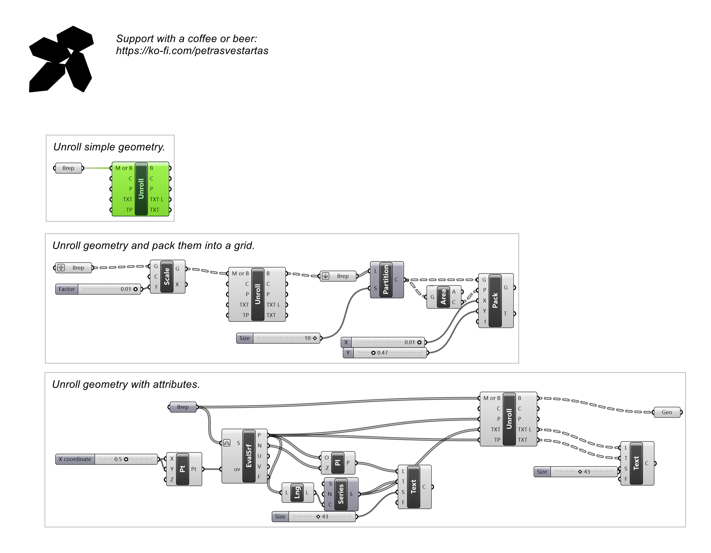
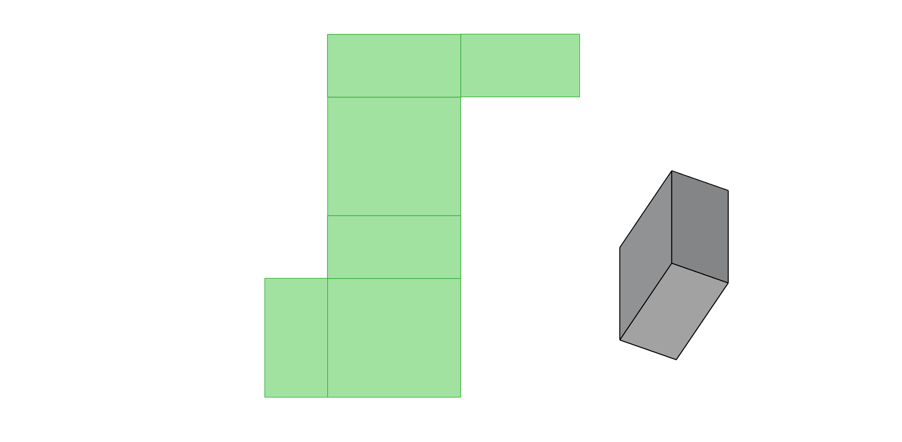

# Unroll

Unrolls a developable Brep or mesh to flat, carrying along its curves, points and text.

## Example

**Files to download:**

- [⬇ unroll.ghx](files/unroll/unroll.ghx)

## Inputs

| Parameter | Type | Access | Description |
| --- | --- | --- | --- |
| **Mesh or Brep** (M or B) | Generic | item | Mesh or Brep to unroll. |
| **Curves** (C) | Curve | list | Curves to unroll along with the surface |
| **Points** (P) | Point | list | Points to unroll along with the surface |
| **Text** (TXT) | Text | list | Text labels to unroll along with the surface |
| **Text point** (TP) | Point | list | Anchor points for the text labels |

## Outputs

| Parameter | Type | Description |
| --- | --- | --- |
| **Brep** (B) | Brep | Unrolled Brep |
| **Curves** (C) | Curve | Unrolled curves |
| **Points** (P) | Point | Unrolled points |
| **TextDotsLocation** (TXT L) | Generic | Unrolled text label locations |
| **TextDots** (TXT) | Generic | Unrolled text labels |
