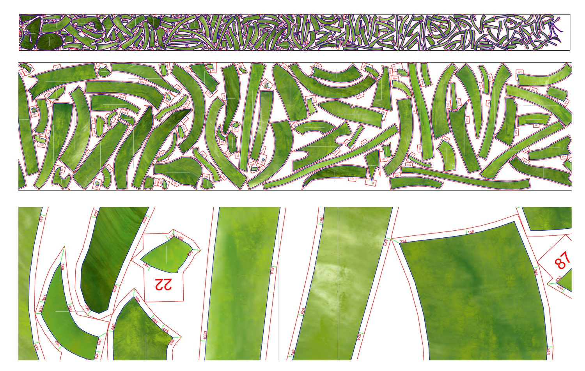
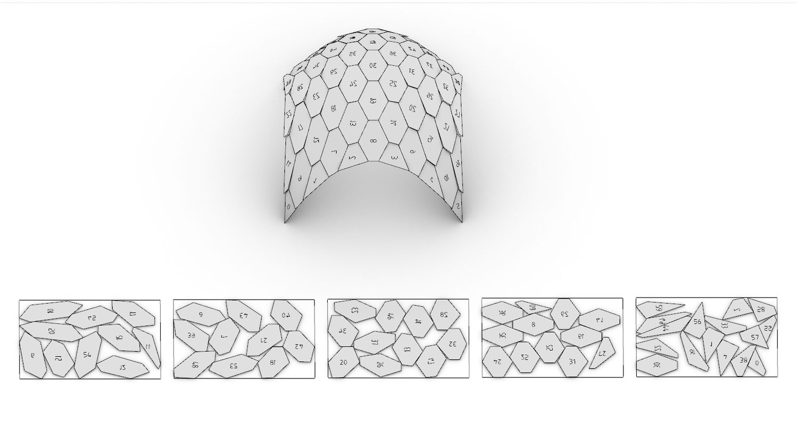
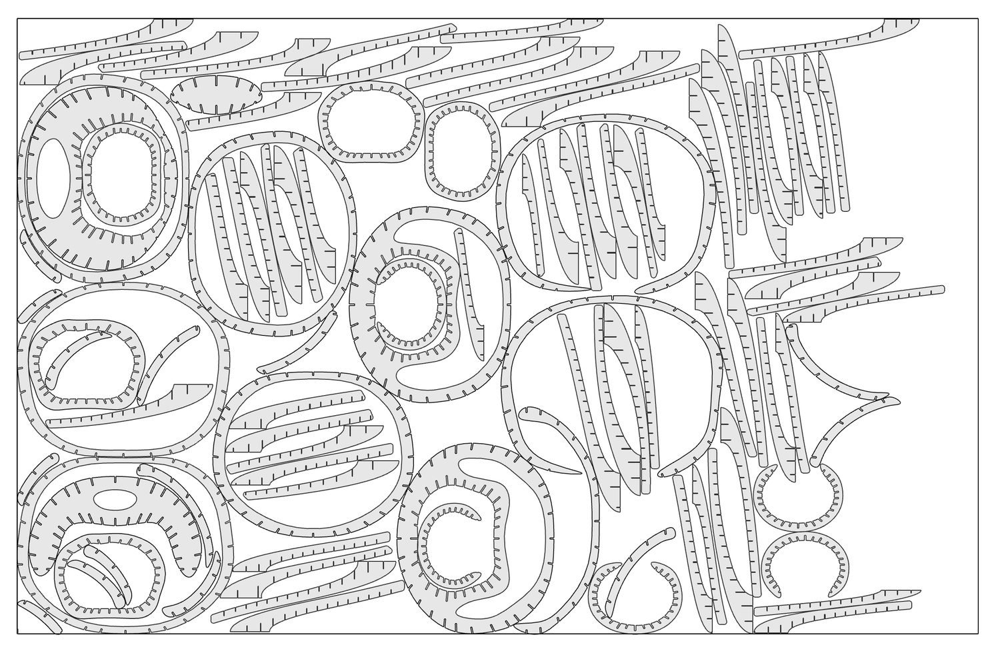
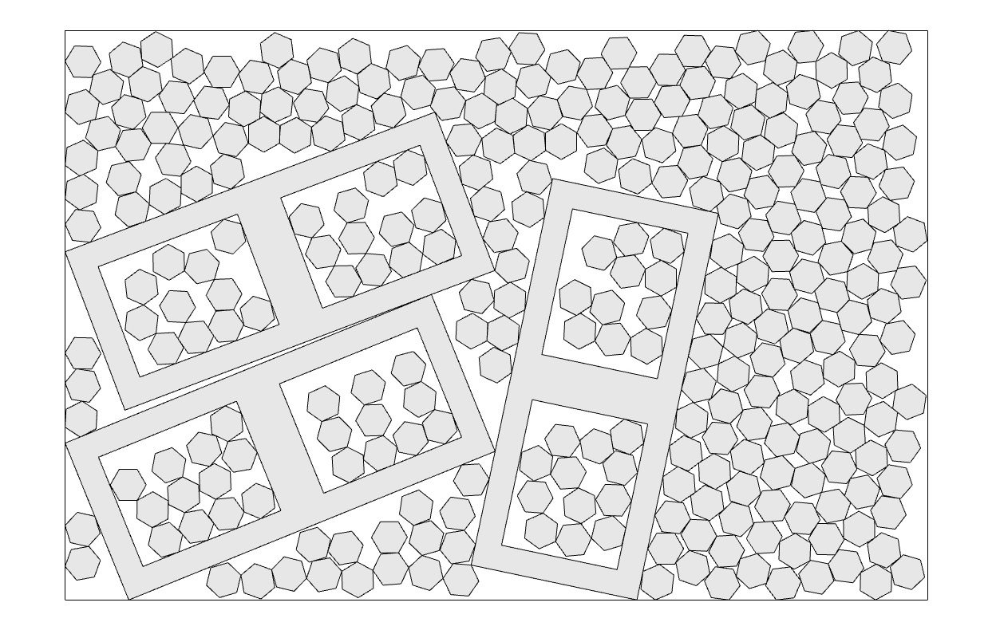
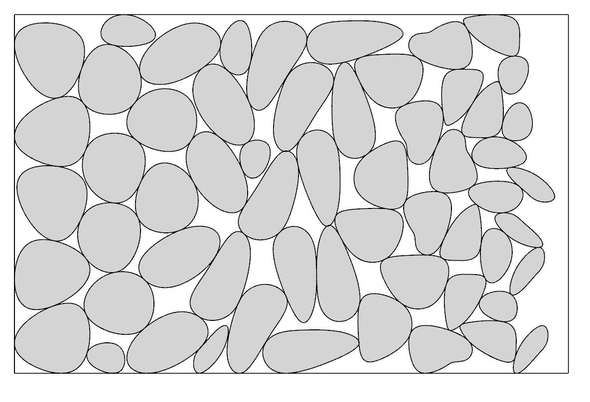
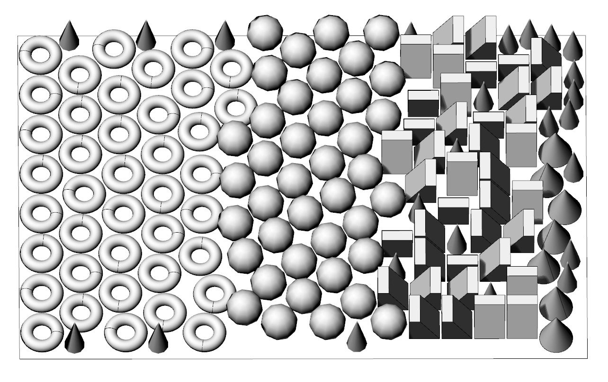
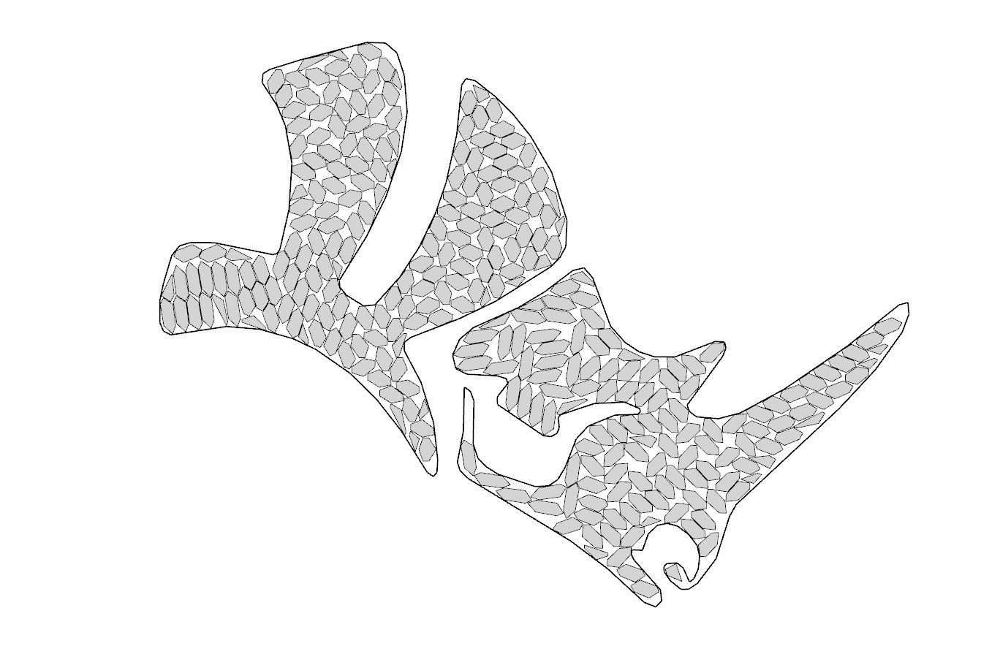
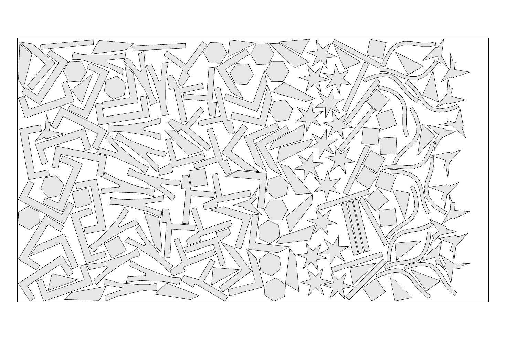
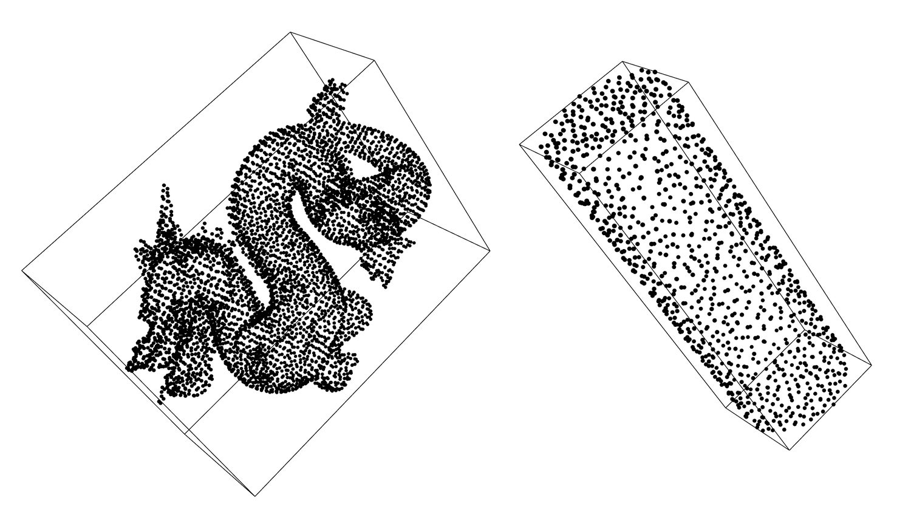
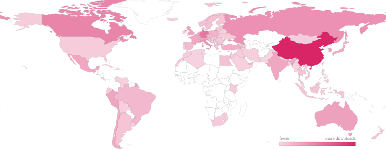

---
hide:
  - navigation
  - toc
---

# OpenNest

2D polygonal nesting for Rhino — pack irregular parts onto sheets with minimal waste, fast. Parts and sheets can have holes, small parts nest inside larger parts' holes, and sheets can be non‑rectangular. The engines are native C++.

[Get started](components/opennest2.md){ .md-button .md-button--primary }
[View on GitHub](https://github.com/petrasvestartas/OpenNest){ .md-button }

## Rhino3D

-   :material-puzzle-outline: &nbsp; __Rhino Grasshopper__

    ---

    A full set of components with a live on‑canvas preview, for Grasshopper 1 and 2 — identical inputs, outputs and tutorials in both editors, each with a downloadable example.

    [:octicons-arrow-right-24: OpenNest2](components/opennest2.md)

-   :material-cube-scan: &nbsp; __Rhino Command__

    ---

    The `OpenNest` command nests directly in the viewport — select sheets and parts, then bake to layers, carrying each part's markings, colours and object data.

    [:octicons-arrow-right-24: Rhino command](rhino/index.md)

-   :material-code-braces: &nbsp; __From code__

    ---

    Call the same engines directly through a plain C ABI — from C++, C# or Python — with a runnable example for every function.

    [:octicons-arrow-right-24: APIs](api/cpp/index.md)

## C++, C# &amp; Python

-   :simple-cplusplus: &nbsp; __C++__

    ---

    Three native engines through a plain C ABI; build from source with CMake. Eight self‑contained examples.

    [:octicons-arrow-right-24: C++ examples](api/cpp/index.md)

-   :simple-dotnet: &nbsp; __C#__

    ---

    P/Invoke the same engines from .NET, no Rhino required. The eight examples mirror the C++ set.

    [:octicons-arrow-right-24: C# examples](api/csharp/index.md)

-   :material-language-python: &nbsp; __Python__

    ---

    Drive the engines from Python, including the Rhino 8 Script Editor, via `compas_nest` (`pip install compas_nest`).

    [:octicons-arrow-right-24: Python examples](api/python/index.md)

## Why OpenNest

-   __Any sheet shape__

    Sheets don't have to be rectangles — nest into non‑rectangular offcuts and remnants, holes and all.

-   __Native C++ speed__

    Three self‑contained C++ engines — `nfp_nest` (no‑fit‑polygon + genetic algorithm, with a rectangle fast path), `nest_physics` (collision / overlap‑relaxation) and `nest_spectral` (3D mesh packing) — with no heavy dependencies.

-   __Carries your data__

    Markings, colours, text and object attributes travel with each part through placement and baking.

## Install

-   :material-numeric-1-circle: &nbsp; __Grasshopper&nbsp;+&nbsp;Rhino&nbsp;command__

    ---

    In Rhino: run `_PackageManager` → search OpenNest → Install, then restart Rhino.

    Works on Rhino 8 and 9, Windows and macOS — delivers the Grasshopper 1 components and the `OpenNest` command.

    On Rhino 8 for Windows it loads under **both** .NET runtimes, .NET Core and .NET Framework 4.8 — you never need `_SetDotNetRuntime`.

-   :material-numeric-2-circle: &nbsp; __Grasshopper&nbsp;2 (Rhino&nbsp;9&nbsp;WIP)__

    ---

    Grasshopper 2 loads manually: after the install above, open Grasshopper 2 and load `opennest_gh2.rhp` from the package's `grasshopper2/` folder.

    [:octicons-arrow-right-24: Step‑by‑step with screenshots](components/grasshopper2.md)

-   :material-numeric-3-circle: &nbsp; __Python__

    ---

    Run `pip install compas_nest` — the same C++ engines from Python, including the Rhino 8 Script Editor.

    [:octicons-arrow-right-24: Python examples](api/python/index.md)

<figure class="install-figure" markdown>
{ .bordered }
<figcaption>Rhino Package Manager — search “OpenNest”, then Install.</figcaption>
</figure>

## OpenNest in numbers

  
211'434downloads

  
50'647users

  
100+countries

<figure class="dlchart-fig">
<svg viewBox="0 0 760 340" class="dlchart" role="img" aria-label="OpenNest downloads and users per year" xmlns="http://www.w3.org/2000/svg">
<line x1="48" y1="294" x2="744" y2="294" stroke="currentColor" stroke-opacity="0.25"/>
<rect x="62.7" y="291.6" width="22.5" height="2.4" rx="2" fill="#d81b60" fill-opacity="0.85"/>
<text x="73.9" y="287.6" text-anchor="middle" font-size="9.5" fill="currentColor" fill-opacity="0.85">405</text>
<rect x="88.2" y="292.3" width="22.5" height="1.7" rx="2" fill="#d81b60" fill-opacity="0.40"/>
<text x="99.4" y="288.3" text-anchor="middle" font-size="8.5" fill="currentColor" fill-opacity="0.55">289</text>
<text x="86.7" y="310" text-anchor="middle" font-size="11" fill="currentColor" fill-opacity="0.6">2018</text>
<rect x="140.0" y="265.6" width="22.5" height="28.4" rx="2" fill="#d81b60" fill-opacity="0.85"/>
<text x="151.3" y="261.6" text-anchor="middle" font-size="9.5" fill="currentColor" fill-opacity="0.85">4'765</text>
<rect x="165.5" y="276.8" width="22.5" height="17.2" rx="2" fill="#d81b60" fill-opacity="0.40"/>
<text x="176.7" y="272.8" text-anchor="middle" font-size="8.5" fill="currentColor" fill-opacity="0.55">2'892</text>
<text x="164.0" y="310" text-anchor="middle" font-size="11" fill="currentColor" fill-opacity="0.6">2019</text>
<rect x="217.4" y="236.5" width="22.5" height="57.5" rx="2" fill="#d81b60" fill-opacity="0.85"/>
<text x="228.6" y="232.5" text-anchor="middle" font-size="9.5" fill="currentColor" fill-opacity="0.85">9'644</text>
<rect x="242.8" y="264.6" width="22.5" height="29.4" rx="2" fill="#d81b60" fill-opacity="0.40"/>
<text x="254.1" y="260.6" text-anchor="middle" font-size="8.5" fill="currentColor" fill-opacity="0.55">4'931</text>
<text x="241.3" y="310" text-anchor="middle" font-size="11" fill="currentColor" fill-opacity="0.6">2020</text>
<rect x="294.7" y="154.8" width="22.5" height="139.2" rx="2" fill="#d81b60" fill-opacity="0.85"/>
<text x="305.9" y="150.8" text-anchor="middle" font-size="9.5" fill="currentColor" fill-opacity="0.85">23'348</text>
<rect x="320.2" y="253.7" width="22.5" height="40.3" rx="2" fill="#d81b60" fill-opacity="0.40"/>
<text x="331.4" y="249.7" text-anchor="middle" font-size="8.5" fill="currentColor" fill-opacity="0.55">6'754</text>
<text x="318.7" y="310" text-anchor="middle" font-size="11" fill="currentColor" fill-opacity="0.6">2021</text>
<rect x="372.0" y="58.8" width="22.5" height="235.2" rx="2" fill="#d81b60" fill-opacity="0.85"/>
<text x="383.3" y="54.8" text-anchor="middle" font-size="9.5" fill="currentColor" fill-opacity="0.85">39'440</text>
<rect x="397.5" y="240.4" width="22.5" height="53.6" rx="2" fill="#d81b60" fill-opacity="0.40"/>
<text x="408.7" y="236.4" text-anchor="middle" font-size="8.5" fill="currentColor" fill-opacity="0.55">8'993</text>
<text x="396.0" y="310" text-anchor="middle" font-size="11" fill="currentColor" fill-opacity="0.6">2022</text>
<rect x="449.4" y="89.3" width="22.5" height="204.7" rx="2" fill="#d81b60" fill-opacity="0.85"/>
<text x="460.6" y="85.3" text-anchor="middle" font-size="9.5" fill="currentColor" fill-opacity="0.85">34'332</text>
<rect x="474.8" y="253.7" width="22.5" height="40.3" rx="2" fill="#d81b60" fill-opacity="0.40"/>
<text x="486.1" y="249.7" text-anchor="middle" font-size="8.5" fill="currentColor" fill-opacity="0.55">6'754</text>
<text x="473.3" y="310" text-anchor="middle" font-size="11" fill="currentColor" fill-opacity="0.6">2023</text>
<rect x="526.7" y="40.0" width="22.5" height="254.0" rx="2" fill="#d81b60" fill-opacity="0.85"/>
<text x="537.9" y="36.0" text-anchor="middle" font-size="9.5" fill="currentColor" fill-opacity="0.85">42'600</text>
<rect x="552.2" y="247.6" width="22.5" height="46.4" rx="2" fill="#d81b60" fill-opacity="0.40"/>
<text x="563.4" y="243.6" text-anchor="middle" font-size="8.5" fill="currentColor" fill-opacity="0.55">7'786</text>
<text x="550.7" y="310" text-anchor="middle" font-size="11" fill="currentColor" fill-opacity="0.6">2024</text>
<rect x="604.0" y="61.5" width="22.5" height="232.5" rx="2" fill="#d81b60" fill-opacity="0.85"/>
<text x="615.3" y="57.5" text-anchor="middle" font-size="9.5" fill="currentColor" fill-opacity="0.85">38'991</text>
<rect x="629.5" y="243.9" width="22.5" height="50.1" rx="2" fill="#d81b60" fill-opacity="0.40"/>
<text x="640.7" y="239.9" text-anchor="middle" font-size="8.5" fill="currentColor" fill-opacity="0.55">8'397</text>
<text x="628.0" y="310" text-anchor="middle" font-size="11" fill="currentColor" fill-opacity="0.6">2025</text>
<rect x="681.4" y="187.2" width="22.5" height="106.8" rx="2" fill="#d81b60" fill-opacity="0.85"/>
<text x="692.6" y="183.2" text-anchor="middle" font-size="9.5" fill="currentColor" fill-opacity="0.85">17'909</text>
<rect x="706.8" y="271.0" width="22.5" height="23.0" rx="2" fill="#d81b60" fill-opacity="0.40"/>
<text x="718.1" y="267.0" text-anchor="middle" font-size="8.5" fill="currentColor" fill-opacity="0.55">3'851</text>
<text x="705.3" y="310" text-anchor="middle" font-size="11" fill="currentColor" fill-opacity="0.6">2026*</text>
<rect x="48" y="14" width="11" height="11" rx="2" fill="#d81b60" fill-opacity="0.85"/>
<text x="64" y="23" font-size="12" fill="currentColor" fill-opacity="0.75">downloads / year</text>
<rect x="198" y="14" width="11" height="11" rx="2" fill="#d81b60" fill-opacity="0.40"/>
<text x="214" y="23" font-size="12" fill="currentColor" fill-opacity="0.75">users / year</text>
</svg>
<figcaption>Downloads (solid) versus active users (light) each year (food4Rhino, Nov&nbsp;2018&nbsp;–&nbsp;Jun&nbsp;2026; 2026* is a partial year). The gap between the bars is repeat downloading — about four downloads per user.</figcaption>
</figure>

<figure class="dlchart-fig worldmap-fig">

<figcaption>Downloads by country, inferred from each user's email domain. About a third of users have a country‑specific domain; global webmail (Gmail, Outlook…) is country‑agnostic and isn't shown, so some countries — the US especially — are undercounted. Most: China, Germany, Canada, Russia, Italy, Australia, UK, South&nbsp;Korea, Peru.</figcaption>
</figure>
