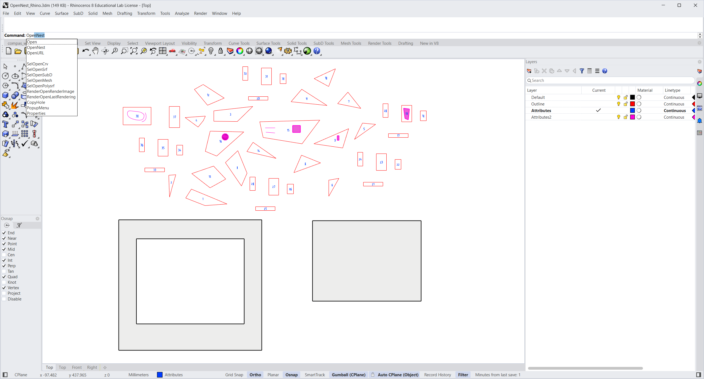
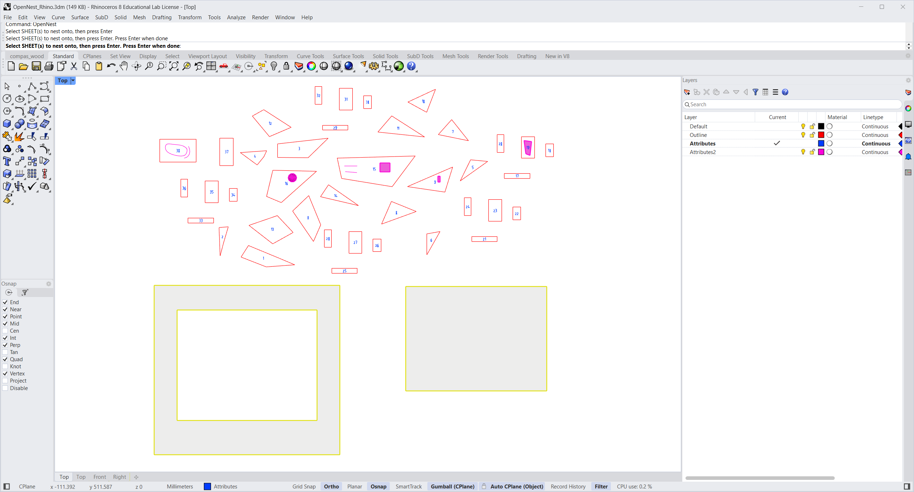
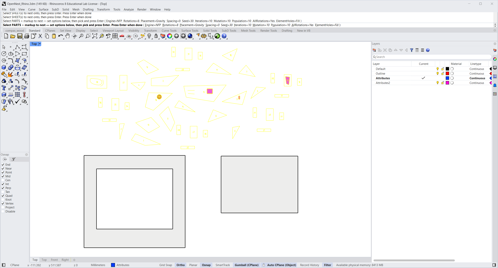
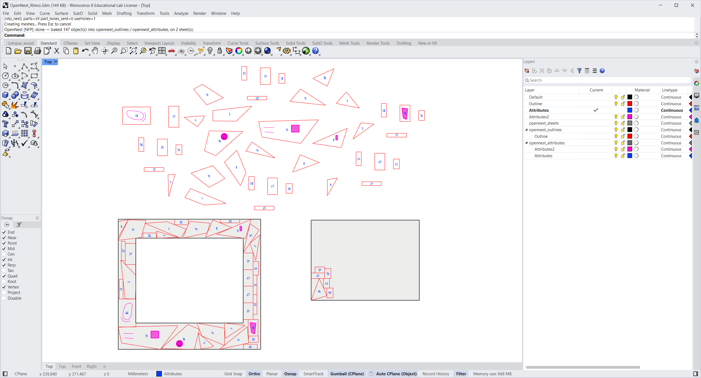

# Nesting in Rhino (the `OpenNest` command)

OpenNest also runs as a **Rhino command** — no Grasshopper needed. Type **`OpenNest`** on the command line,
select your sheets, select your parts, and it nests them on a background thread (Rhino stays responsive) and
**bakes the result into layers**, carrying each part's markings and Rhino object data along.

It installs with the same package as the Grasshopper components (Rhino **Package Manager** → search **OpenNest**),
on both **Windows and macOS** — one install delivers the Grasshopper components *and* the `OpenNest` command.

**Files to download:**

- [⬇ OpenNest_Rhino.3dm](files/OpenNest_Rhino.3dm) — the example model used below.

---

## How it classifies your selection

You make **one mixed selection** of parts and markup; OpenNest sorts it out automatically by geometry type and
spatial containment — the same logic the Grasshopper *Geometry* components use:

| You draw… | …it becomes |
| --- | --- |
| A **planar surface** (or Brep / NURBS surface / SubD / extrusion) standing on its own | a **part** — its outer loop is the border, its **trimmed inner loops are holes** (kept empty) |
| A **closed curve** standing on its own | a **part** (no holes) |
| **Any closed boundary inside a part** (surface / brep / subd / closed curve) | an **attribute** — kept verbatim and moved *with* its part |
| **Any other geometry inside a part** — text, open curves, hatches, points, dots | an **attribute** — moved with its part |

So **holes come only from trimmed surfaces** (exactly like sheets), and anything sitting inside a part — a logo
outline, an engraving, a label, a drilled feature — rides along as an attribute instead of being nested on its own.

---

## Step by step

### 1 · Prepare the model

Lay out your **parts** (closed polylines or planar surfaces) with their **markings on their own layers**
(here: *Outline*, *Attributes*, *Attributes2*), and place your **sheet surfaces** below. Type `OpenNest`.

### 2 · Select the sheets

At **“Select SHEET(s) to nest onto”**, pick the sheet surface(s) and press **Enter**. A surface's trimmed holes
become keep‑out regions automatically.

### 3 · Select the parts and set options

At **“Select PARTS — markup … set options below”**, click the **command‑line options** to configure the nest,
then pick everything (parts **and** their markup) and press **Enter**. Click **`Engine`** to switch between
**NFP** and **Collision** — the option list changes to that engine's settings.

### 4 · Read the result

It solves on a background thread (the prompt shows live `gen X / Y` progress) and **bakes** into three layers,
with a **sublayer per source layer** (name **and** colour copied) so your layer structure and by‑layer colours
are preserved. If the parts don't fit, extra sheet copies are added to the **right** automatically.

**Output layers**

| Layer | Contents |
| --- | --- |
| `opennest_sheets` | the frame of each used sheet |
| `opennest_outlines` | placed part borders (+ holes), under a sublayer per source layer |
| `opennest_attributes` | placed markings (text, curves, breps…), each keeping its own colour / material / name, under a sublayer per source layer |

Each placed part instance (outline + its attributes) is also put into its own **group**, so you can move a nested
part as a unit.

---

## Parameters

Pick the engine first; the options below switch to match it. Values are **sticky** for the Rhino session.

### Engine = NFP (no‑fit‑polygon + genetic algorithm)

| Option | Default | Description |
| --- | --- | --- |
| **Rotations** | 8 | Orientation angles each part may try (360/n). More = tighter, slower. |
| **Placement** | Gravity | Strategy: Box · Gravity · Squeeze · BottomLeft. |
| **Spacing** | 0 | Gap kept between placed parts (model units). |
| **Seed** | 30 | Random seed (same seed = same result). |
| **Iterations** | 10 | GA generations to evolve — the result tightens each generation. |
| **Mutation** | 10 | GA mutation rate. |
| **Population** | 10 | GA population size. |
| **AllRotations** | Yes | Try every orientation per placement for the tightest pack (capped at 8). |
| **ElementHoles** | Fill | Nest smaller parts **into** larger parts' holes (Off / Fill). |

### Engine = Collision (penetration‑depth physics relaxation)

| Option | Default | Description |
| --- | --- | --- |
| **Rotations** | 3600 | Orientation angles each part may try; more = tighter, slower. |
| **Seed** | 100 | Random seed; change it if a run spills to a second sheet. |
| **Starts** | 1 | Multi‑start: run this many seeds and keep the densest. |
| **Iterations** | 4000 | Relaxation rounds; higher packs tighter but is slower. |
| **Poles** | 48 | Inscribed circles per part for collision tests; more = cleaner pack, slower. |
| **ElementHoles** | Fill | Nest small parts into larger parts' holes (Off / Fill / FillFirst). |
| **Compact** | BottomLeft | Post‑pack tightening slide (Off / BottomLeft / Multi). |
| **Fit** | OneSheet | OneSheet = fill a single sheet (overflow placed outside); AllParts = use as many sheets as needed. |

!!! tip "Which engine?"
    **NFP** packs with exact no‑fit‑polygon math — best for clean, non‑overlapping layouts of polygonal parts.
    **Collision** uses an inscribed‑circle (Poles) surrogate that relaxes overlaps — great for dense packing, but
    very sharp corners can need more **Poles**. For guaranteed no‑overlap on spiky shapes, use **NFP**.

---

## Notes

- The boundary is taken **exactly as drawn** (no simplification), so placed parts never overlap their neighbours.
- The solve runs on a background thread and keeps Rhino responsive (you can orbit/zoom while it works); the
  command line shows live progress.
- Results are baked as real Rhino geometry (not a live preview), wrapped in a single **Undo** — so one `Undo`
  removes the whole nest.
